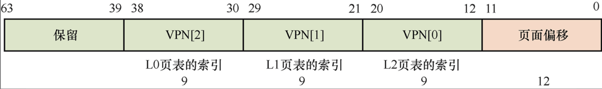
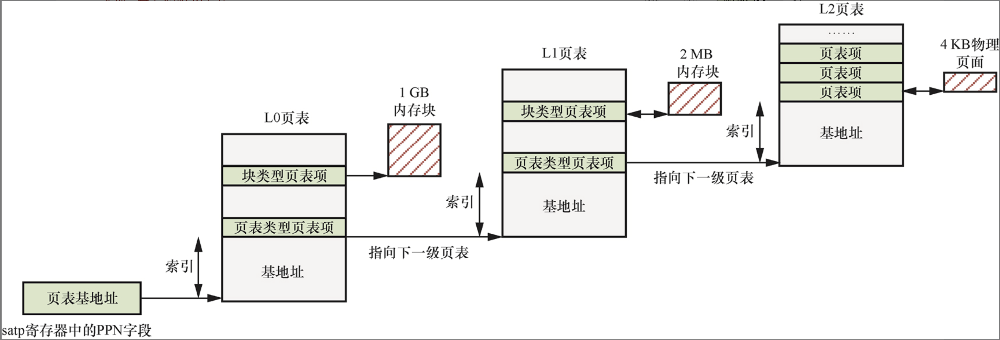
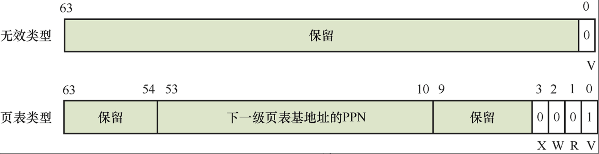
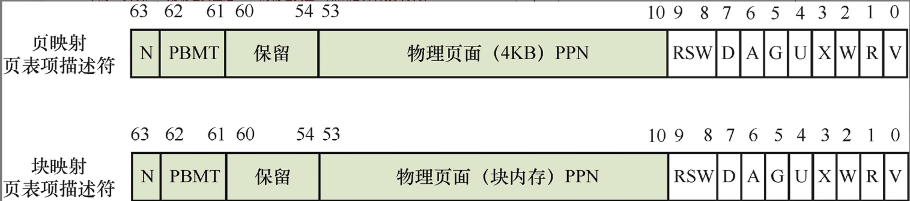

# 内存管理

1. 在计算机发展历史中，为什么会出现分段机制和分页机制？
2. 为什么页表要设计成多级页表？直接使用一级页表是否可行？多级页表又引入了什么问题？
3. 为什么页表存放在主内存中而不是存放在芯片内部的寄存器中？
4. MMU查询页表的目的是找到虚拟地址对应的物理地址，页表项中有指向下一级页表基地址的指针，那它指向的是下一级页表基地址的物理地址还是虚拟地址？
5. 在PMP机制中，NAPOT模式如何表示地址的范围？
6. 请简述在RISC-V处理器中Sv39页表映射模式的三级页表的映射过程。
7. 打开MMU时，为什么需要建立恒等映射？
8. 在RISC-V处理器中，页表项属性中有一个A访问字段，它有什么作用？

## 内存管理基础知识

## RISC-V内存管理

RISC-V处理器内核的MMU包括TLB和页表遍历单元两个部件。

### 页表分类

+ Sv32：仅支持32位RSIC-V处理器，是一个二级页表结构，支持32位虚拟地址转换。
+ Sv39：支持64位RSIC-V处理器（其中虚拟地址的低39位用作页表索引）​，是一个三级页表结构，支持39位虚拟地址转换。
+ Sv48：支持64位RSIC-V处理器（其中虚拟地址的低48位用作页表索引）​，是一个四级页表结构，支持48位虚拟地址转换。

### Sv39页表映射

Sv39模式表示64位的虚拟地址中只有低39位用于页表索引，剩余的高位必须和第38位相等，否则处理器会触发缺页异常。在Sv39模式下，64位的虚拟地址中只有低39位为有效位，可用于页表地址转换，并**最终映射到56位的物理地址上**。当虚拟地址的第38位为0或者1时，整个虚拟地址空间被划分成3个区域

当第38位为0时，剩余的高位也为0，这样就组成了低位的虚拟地址空间，它位于0x0到0x0000 003F FFFF FFFF，大小为256 GB。操作系统通常把该虚拟地址区间用作用户空间。
当第38位为1时，剩余的高位也为1，这样就组成了高位的虚拟地址空间，它位于0xFFFF FFC0 0000 0000到0xFFFF FFFF FFFF FFFF，大小为256 GB。操作系统通常把该虚拟地址区间用作内核空间。
中间部分为非映射区域，即Bit[63:38]不全为0或者不全为1。处理器访问该区域会触发缺页异常。

satp寄存器中的PPN字段存储了页表基地址的页帧号，它指向L0页表的基地址。

L0页表中有许多页表项，页表项通常分成页表类型页表项和块类型页表项。页表类型页表项包含下一级页表的基地址，用来指向下一级页表，而块类型页表项包含大块物理内存的基地址，如1 GB、2 MB等。

### Sv48页表映射

Sv48模式表示64位的虚拟地址中只有低48位地址用于页表索引，剩余的高位必须和第47位相等。Sv48模式支持四级页表，即L0～L3级页表，支持4 KB页面。

### 页表项描述符

Sv39模式以及Sv48模式包含多级页表，每级页表都由多个页表项组成，我们把它们称为页表项描述符，每个页表项描述符占8字节。

**非子叶页表项描述符**

Sv39模式以及Sv48模式包含多级页表，如果页表项描述符中的Bit[3:1]都为0，则该页表项描述符包含指向下一级页表基地址的页帧号，该页表称为非子叶页表(non-leaf page table)。用来描述它对应的页表项的描述符称为非子叶页表项描述符。页表项描述符中的Bit[1]为R字段，Bit[2]为W字段，Bit[3]为X字段。

**子叶页表项描述符**

在Sv39和Sv48模式下，如果页表项描述符中的Bit[3:1]不为0，则该页表项描述符包含指向最终物理地址的字段，该页表称为子叶页表(leafpage table)。用来描述它对应的页表项的描述符称为子叶页表项描述符。子叶页表可以是末级的页表，也可以是中间的某级页表。如果中间的某页表为子叶页表，那么该页表项为块映射页表项描述符，用来描述大块连续物理内存，如2 MB或者1 GB。如果末级页表为子叶页表，那么该页表项为页映射页表项描述符，该页表项描述符指向4 KB大小的物理页面。

### 页表项分类

根据类型，页表项可分成3类：无效的页表项、页表(table)类型的页表项、子叶页表类型的页表项。

对于无效的页表项，当页表项描述符`Bit[0]`为0时，表示无效的描述符；当`Bit[0]`为1时，表示有效的描述符。

子叶页表类型的页表项可分成两种：一种是页映射页表项描述符，另一种是块映射页表项描述符。

+ 低位属性：由Bit[9:0]组成的低位属性。
+ 页帧号：由Bit[53:10]组成的物理页面的页帧号。如果子叶页表类型的描述符是页映射页表项描述符，即该子叶页表是末级的页表​，则物理页面是4 KB的物理页面；如果是块映射页表项描述符，即该子叶页表可以是中间级别的页表​，则物理页面可以是2 MB或者1 GB的大块连续物理内存。
+ 高位属性：由Bit[63:54]组成的高位属性。

**页表项描述符中的低位属性**

| 名称 | 位 | 描述 |
| ---- | ---- | ----- |
| V | `Bit[0]` | 有效位: 1: 页表项有效, 0: 页表项无效 |
| R | `Bit[1]` | 可读属性: 1: 页面内容具有可读属性, 0: 页面内容不具有可读属性 |
| W | `Bit[2]` | 可写属性: 1: 页面内容具有可写属性, 0: 页面内容不具有可写属性 |
| X | `Bit[3]` | 可执行属性: 1: 页面内容具有可执行属性, 0: 页面内容不具有可执行属性 |
| U | `Bit[4]` | 用户访问模式: 1: 用户模式可以访问该页面, 0: 用户模式不可以访问该页面 |
| G | `Bit[5]` | 全局映射: 1: 该页面属于全局映射的页面, 该页面对应的TLB属于全局类型, 0: 该页面属于非全局映射的页面, 该页面对应的TLB属于进程独有,使用ASID来标识 |
| A | `Bit[6]` | 访问标志位: 1: 处理器访问过该页面, 0: 处理器没有访问过该页面 |
| D | `Bit[7]` | 脏标志位: 1: 页面被修改过, 0: 页面是干净的 |
| RSW | `Bit[9:8]` | 预留给系统管理员使用 |
|  | `Bit[]` |  |
|  | `Bit[]` |  |
|  | `Bit[]` |  |
|  | `Bit[]` |  |
|  | `Bit[]` |  |
|  | `Bit[]` |  |
|  | `Bit[]` |  |
|  | `Bit[]` |  |
|  | `Bit[]` |  |
|  | `Bit[]` |  |
|  | `Bit[]` |  |
|  | `Bit[]` |  |
|  | `Bit[]` |  |
|  | `Bit[]` |  |
|  | `Bit[]` |  |
