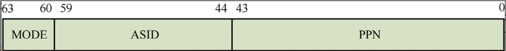
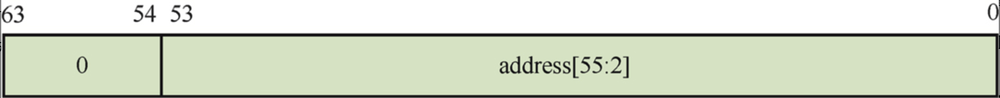
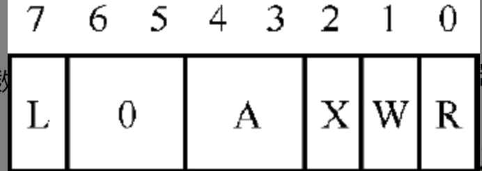

# 内存管理

1. 在计算机发展历史中，为什么会出现分段机制和分页机制？
2. 为什么页表要设计成多级页表？直接使用一级页表是否可行？多级页表又引入了什么问题？
3. 为什么页表存放在主内存中而不是存放在芯片内部的寄存器中？
4. MMU查询页表的目的是找到虚拟地址对应的物理地址，页表项中有指向下一级页表基地址的指针，那它指向的是下一级页表基地址的物理地址还是虚拟地址？
5. 在PMP机制中，NAPOT模式如何表示地址的范围？
6. 请简述在RISC-V处理器中Sv39页表映射模式的三级页表的映射过程。
7. 打开MMU时，为什么需要建立恒等映射？
8. 在RISC-V处理器中，页表项属性中有一个A访问字段，它有什么作用？

## 内存管理基础知识

## RISC-V内存管理

RISC-V处理器内核的MMU包括TLB和页表遍历单元两个部件。

### 页表分类

+ Sv32：仅支持32位RSIC-V处理器，是一个二级页表结构，支持32位虚拟地址转换。
+ Sv39：支持64位RSIC-V处理器（其中虚拟地址的低39位用作页表索引）​，是一个三级页表结构，支持39位虚拟地址转换。
+ Sv48：支持64位RSIC-V处理器（其中虚拟地址的低48位用作页表索引）​，是一个四级页表结构，支持48位虚拟地址转换。

### Sv39页表映射

Sv39模式表示64位的虚拟地址中只有低39位用于页表索引，剩余的高位必须和第38位相等，否则处理器会触发缺页异常。在Sv39模式下，64位的虚拟地址中只有低39位为有效位，可用于页表地址转换，并**最终映射到56位的物理地址上**。当虚拟地址的第38位为0或者1时，整个虚拟地址空间被划分成3个区域

当第38位为0时，剩余的高位也为0，这样就组成了低位的虚拟地址空间，它位于0x0到0x0000 003F FFFF FFFF，大小为256 GB。操作系统通常把该虚拟地址区间用作用户空间。
当第38位为1时，剩余的高位也为1，这样就组成了高位的虚拟地址空间，它位于0xFFFF FFC0 0000 0000到0xFFFF FFFF FFFF FFFF，大小为256 GB。操作系统通常把该虚拟地址区间用作内核空间。
中间部分为非映射区域，即Bit[63:38]不全为0或者不全为1。处理器访问该区域会触发缺页异常。


satp寄存器中的PPN字段存储了页表基地址的页帧号，它指向L0页表的基地址。

L0页表中有许多页表项，页表项通常分成页表类型页表项和块类型页表项。页表类型页表项包含下一级页表的基地址，用来指向下一级页表，而块类型页表项包含大块物理内存的基地址，如1 GB、2 MB等。


### Sv48页表映射

Sv48模式表示64位的虚拟地址中只有低48位地址用于页表索引，剩余的高位必须和第47位相等。Sv48模式支持四级页表，即L0～L3级页表，支持4 KB页面。

### 页表项描述符

Sv39模式以及Sv48模式包含多级页表，每级页表都由多个页表项组成，我们把它们称为页表项描述符，每个页表项描述符占8字节。

**非子叶页表项描述符**

Sv39模式以及Sv48模式包含多级页表，如果页表项描述符中的Bit[3:1]都为0，则该页表项描述符包含指向下一级页表基地址的页帧号，该页表称为非子叶页表(non-leaf page table)。用来描述它对应的页表项的描述符称为非子叶页表项描述符。页表项描述符中的Bit[1]为R字段，Bit[2]为W字段，Bit[3]为X字段。

**子叶页表项描述符**

在Sv39和Sv48模式下，如果页表项描述符中的Bit[3:1]不为0，则该页表项描述符包含指向最终物理地址的字段，该页表称为子叶页表(leafpage table)。用来描述它对应的页表项的描述符称为子叶页表项描述符。子叶页表可以是末级的页表，也可以是中间的某级页表。如果中间的某页表为子叶页表，那么该页表项为块映射页表项描述符，用来描述大块连续物理内存，如2 MB或者1 GB。如果末级页表为子叶页表，那么该页表项为页映射页表项描述符，该页表项描述符指向4 KB大小的物理页面。

### 页表项分类

根据类型，页表项可分成3类：无效的页表项、页表(table)类型的页表项、子叶页表类型的页表项。

对于无效的页表项，当页表项描述符`Bit[0]`为0时，表示无效的描述符；当`Bit[0]`为1时，表示有效的描述符。


子叶页表类型的页表项可分成两种：一种是页映射页表项描述符，另一种是块映射页表项描述符。

+ 低位属性：由Bit[9:0]组成的低位属性。
+ 页帧号：由Bit[53:10]组成的物理页面的页帧号。如果子叶页表类型的描述符是页映射页表项描述符，即该子叶页表是末级的页表​，则物理页面是4 KB的物理页面；如果是块映射页表项描述符，即该子叶页表可以是中间级别的页表​，则物理页面可以是2 MB或者1 GB的大块连续物理内存。
+ 高位属性：由Bit[63:54]组成的高位属性。


**页表项描述符中的低位属性**

| 名称 | 位 | 描述 |
| ---- | ---- | ----- |
| V | `Bit[0]` | 有效位: 1: 页表项有效, 0: 页表项无效 |
| R | `Bit[1]` | 可读属性: 1: 页面内容具有可读属性, 0: 页面内容不具有可读属性 |
| W | `Bit[2]` | 可写属性: 1: 页面内容具有可写属性, 0: 页面内容不具有可写属性 |
| X | `Bit[3]` | 可执行属性: 1: 页面内容具有可执行属性, 0: 页面内容不具有可执行属性 |
| U | `Bit[4]` | 用户访问模式: 1: 用户模式可以访问该页面, 0: 用户模式不可以访问该页面 |
| G | `Bit[5]` | 全局映射: 1: 该页面属于全局映射的页面, 该页面对应的TLB属于全局类型, 0: 该页面属于非全局映射的页面, 该页面对应的TLB属于进程独有,使用ASID来标识 |
| A | `Bit[6]` | 访问标志位: 1: 处理器访问过该页面, 0: 处理器没有访问过该页面 |
| D | `Bit[7]` | 脏标志位: 1: 页面被修改过, 0: 页面是干净的 |
| RSW | `Bit[9:8]` | 预留给系统管理员使用 |

页表项描述符中的高位属性属于RISC-V体系结构中的“Svpbmt”扩展，将来用于替代物理内存属性(Physical Memory Attribute, PMA)机制。

| 名称 | 位 | 描述 |
| ------ | ------- | ----- |
| PBMT | `Bit[62:61]` | 用来表示映射页面的内存属性: 0: 无; 1: 普通内存,关闭高速缓存支持弱一致性内存模型; 2: I/O内存,关闭高速缓存支持强一致性内存模型; 3: 保留 |
| N | `Bit[63]` | 连续块表项 |

由于非叶页表类型的页表项中的A、D以及U标志位预留给未来使用，因此需要把这些位设置为0。在使能了虚拟内存管理机制与A扩展的处理器中，LR/SC指令的保留集(reservation set)必须在一个页面中。

```
保留集是一个地址范围:
- LR指令执行后,硬件记录一个地址范围
- 这个范围包含LR访问的地址
- SC指令检查这个范围是否还有效

保留集的作用:
- 检测是否有其他核心访问了相同内存
- 如果有,SC失败,需要重试

```

### 页表项的常见属性

**访问权限**

+ 如果在没有可执行权限的页面中预取指令，触发预取缺页异常(fetch page fault)。
+ 如果在没有可读权限的页面加载数据，触发加载缺页异常(load page fault)。
+ 如果在没有可写权限的页面里写入数据，触发存储缺页异常(store page fault)。

另外，当页表项属性中的U字段为1时，表示用户态程序可以访问该页面。如果sstatus寄存器中的SUM字段也设置为1，那么S模式下的软件也可以访问该页面。不过，S模式下的软件不应该执行页表属性中U字段为1的页面里的程序代码。

**访问标志位与脏标志位**

页表项属性中有一个访问标志位A(access)，用来指示页面是否被CPU访问过。

+ 如果A字段为1，表示页面已经被CPU访问过。
+ 如果A字段为0，表示页面还没有被CPU访问。

页表项属性中的脏标志位Dcdirty用来表示页面内容是否被写入或者修改过。

若以软件方式更新A和D标志位，有以下两种方法。

+ 当CPU尝试访问页面并且该页面对应的A标志位为0时，会触发缺页异常，然后软件就可以设置A标志位为1。
+ 当CPU尝试修改或者写入页面并且对应的D标志位为0时，会触发缺页异常，然后软件就可以设置D标志位为1。

若采用硬件方式，页表项(PTE)的更新必须是原子的，即CPU会原子地更新整个页表项，而不是仅更新某个标志位。另外，CPU在更新A标志位时允许预测(speculation)执行，而D标志位的更新必须是精确的，即不允许预测执行，并且在本地CPU里是按照程序次序执行的。操作系统通常使用A和D标志位实现页面回收(page reclaim)。D标志位更新的精确性会影响页面回收的正确性。若以硬件方式更新A和D标志位，有以下两种方法。

+ 当CPU尝试访问页面并且该页面的A标志位为0时，CPU自动设置A标志位。
+ 当CPU尝试修改或者写入页面并且该页面的D标志位为0时，CPU自动设置D标志位。

操作系统使用访问标志位有如下好处。可以判断某个已经分配的页面是否被操作系统访问过。

+ 如果访问标志位为0，说明这个页面没有被操作系统访问过。
+ 可以实现操作系统中的页面回收机制。

**连续块页表项**

RISC-V体系结构在页表设计方面考虑了TLB的优化，即利用一个TLB项来完成多个连续的虚拟地址到物理地址的映射。子叶页表项描述符中的N字段就用来实现TLB优化功能。

### 与地址转换相关的寄存器

与地址转换相关的寄存器主要是satp寄存器



satp寄存器中一共有3个字段。

+ PPN字段：存储L0页表基地址的页帧号。
+ ASID字段：进程地址空间标识符(Address Space IDentifier, ASID)，用于优化TLB。
+ MODE字段：用来选择地址转换的模式。

对于32位RISC-V处理器

| mode字段 | 值 | 说明 |
| ------- | --- | ---- |
| Bare | 0 | 没有实现地址转换功能 |
| Sv32 | 1 | 实现32位虚拟地址转换(分页机制) |

对于64位RISC-V处理器

| mode字段 | 值 | 说明 |
| ------- | --- | ---- |
| Bare | 0 | 没有实现地址转换功能 |
| 保留 | 1~7 | 保留 |   
| Sv39 | 8 | 实现39位虚拟地址转换(分页机制) |   
| Sv48 | 9 | 实现48位虚拟地址转换(分页机制) |   
| Sv57 | 10 | 保留，用来将来实现57位虚拟地址转换(分页机制) |   
| Sv64 | 11 | 保留，用来实现64位虚拟地址转换(分页机制) |   

### 物理内存属性与物理内存保护

RISC-V体系结构提供两种机制来对物理内存访问进行检查与保护，它们分别是**物理内存属性(Physical MemoryAttributes, PMA)**和**物理内存保护(Physical Memory Protection, PMP)**。在RISC-V处理器中，这两种机制可以同时发挥作用。

**物理内存属性**

在RISC-V体系结构中，使用PMA来描述内存映射中的每个地址区域访问的属性。这些属性包含访问类型（如是否可执行、可读或可写）​，以及与访问相关的其他可选属性。

PMA一般是在芯片设计阶段就固定下来的，有些（例如，连接到不同的芯片片选或者总线等）则在硬件开发板设计阶段固定下来，系统执行阶段很少修改它。RISC-V处理器中通常会实现一个PMA检测器，当ITLB、DTLB以及页表遍历单元获得物理地址之后，PMA检测器会做物理地址权限和属性检查。检查到违规后，触发指令/加载/存储访问异常。

**物理内存保护**

在RISC-V体系结构中，M模式具有最高特权，拥有访问系统全部资源的权限。为了安全，默认情况下S模式和U模式对内存映射的任何区域都没有可读、可写和可执行权限，除非配置PMP以允许它们访问。如果处理器运行在M模式，只有当L字段被设置时才会做PMP检查。当有效的处理器模式为S模式或者U模式时，会对每次的访问做PMP检查。另外，根据mstatus寄存器中MPRV字段的值，在如下两种情况下，也需要做PMP检查。

+ MPRV字段为0并且处于U模式或者S模式下的指令预取和数据访问。
+ 当MPRV为1并且MPP为S/U模式时，在任意处理器模式下，对数据访问都需要做PMP检查。

另外，在MMU遍历页表的过程中也会做PMP检查。

RISC-V体系结构使用配置表项（8位宽的字段，用pmpNcfg表示，N表示表项数）以及对应的64位地址寄存器来描述一段地址空间的PMP配置属性。RISC-V体系结构最多支持64个PMP表项。在芯片设计阶段，根据需求，实现0个、16个以及64个PMP表项。



PMP表项



| 字段 | 位 | 说明 |
| ----- | --- | --- |
| R | `Bit[0]` | 可读权限. 0: 没有读权限; 1:具有读权限; |
| W | `Bit[1]` | 可写权限. 0:没有写权限; 1:具有写权限; |
| X | `Bit[2]` | 可执行权限. 0:没有执行权限; 1:具有执行权限; |
| A | `Bit[4:3]` | 地址匹配模式. 0:关闭对PMP表项对应的检查; 1:TOR模式; 2:NA4模式,即PMP表项对应的地址范围仅为4字节; 3:NAPOT模式; |
| L | `Bit[7]` | 锁定状态. 0:PMP表项没有锁定,对M模式不起作用,仅对S模式和U模式起作用; 1:PMP表项锁定，对所有处理器模式(包括M模式)都起作用; |

> 注：TOR不是用来"找到"PMP表项的位置，而是定义PMP表项所保护的地址范围。

表中TOR模式的地址范围由前一个PMP表项的地址寄存器代表的起始地址（假设为pmpaddr(i − 1)）和当前PMP表项的地址寄存器代表的起始地址（假设为pmpaddri）共同决定，因此当前PMP表项代表的地址范围为

`pmpaddr(i − 1) ≤ y ＜ pmpaddr(i)`

存在一种特殊情况：如果当前PMP表项是第0个表项并且A字段为TOR，那么地址空间的下界被视为0。此时，当前PMP表项代表的地址范围为

`0 ≤ y ＜ pmpaddr(i)`

NAPOT(Naturally Aligned Power-Of-Two region)模式采用`2^n`自然对齐的方式，其地址范围计算方式是从PMP地址寄存器第0位开始计算连续为1的个数n，则地址的长度为2^(n+3) B。我们采用LSZB（Least Significant ZeroBit，最低有效零位）来表示从第0位开始计算连续为1的个数。 

如果PMP地址寄存器的值为yyyy…yyy0，即LSZB个数为0，则该PMP表项所控制的地址空间为从yyyy…yyy0开始的2^3 B，即8 B。

如果PMP地址寄存器的值为yyyy…yy01，即LSZB个数为1，则该PMP表项所控制的地址空间为从yyyy…yy00开始的2^(1+3) B，即16 B。

如果PMP地址寄存器的值为yy01…1111，即LSZB个数为n，则该PMP表项所控制的地址空间为从yy00…0000开始的2^(n+3) B。


## 补充

问题的本质

开启 MMU 时的危险场景
``` assembly
地址 0x80000000:  li t0, 1
地址 0x80000004:  csrw satp, t0        # 开启 MMU
地址 0x80000008:  add t1, t2, t3       # ← 这条指令已经被预取！
地址 0x8000000c:  ...
```

**执行过程**：
```
1. CPU 流水线预取指令（MMU 关闭时）：
   - 0x80000000: li t0, 1        (物理地址预取) ✓
   - 0x80000004: csrw satp, t0   (物理地址预取) ✓
   - 0x80000008: add t1, t2, t3  (物理地址预取) ✓ ← 已在流水线中
   - 0x8000000c: ...             (物理地址预取) ✓

2. 执行 csrw satp, t0：
   MMU 立即生效！✅
   
3. 下一条指令 (0x80000008)：
   ❌ 问题来了！
   - 这条指令已经用物理地址 0x80000008 预取了
   - 但 MMU 现在开启了
   - CPU 会认为 0x80000008 是虚拟地址
   - 查页表：虚拟地址 0x80000008 → 映射到哪个物理地址？
   
4. 两种可能的结果：
   情况 A：页表中 VA 0x80000008 → PA 0x80000008 (恒等映射)
           ✅ 正常执行
           
   情况 B：页表中没有映射，或映射到其他地址
           ❌ 页错误异常（Page Fault）
           ❌ 或者跳到错误的地址执行
           ❌ 系统崩溃！
```

**必须考虑的问题**

问题 1：需要恒等映射（Identity Mapping）
```c
// 错误示例：没有恒等映射
void enable_mmu_wrong() {
    // 假设当前 PC = 0x80000100
    
    // 页表只映射了高地址
    // VA 0xffffffc080000000 → PA 0x80000000
    
    write_csr(satp, page_table);  // 开启 MMU
    
    // ❌ 下一条指令 PC = 0x80000104
    // ❌ MMU 查找 VA 0x80000104
    // ❌ 页表中没有这个映射
    // ❌ Page Fault！系统崩溃
}

// 正确示例：建立恒等映射
void enable_mmu_correct() {
    // 当前 PC = 0x80000100
    
    // 页表映射：
    // 1. 恒等映射：VA 0x80000000 → PA 0x80000000
    // 2. 高地址映射：VA 0xffffffc080000000 → PA 0x80000000
    
    write_csr(satp, page_table);  // 开启 MMU
    
    // ✅ 下一条指令 PC = 0x80000104
    // ✅ MMU 查找 VA 0x80000104
    // ✅ 找到恒等映射：0x80000104 → 0x80000104
    // ✅ 继续正常执行
    
    // 之后跳转到高地址
    jump_to_high_address();
}
```

问题 2：需要刷新指令缓存和 TLB

```assembly
# 开启 MMU 的标准流程
enable_mmu:
    # 1. 加载页表地址
    la t0, page_table_root
    srli t0, t0, 12          # 转换为 PPN
    li t1, (8 << 60)         # Sv39 模式
    or t0, t0, t1
    
    # 2. 写入 satp（开启 MMU）
    csrw satp, t0
    
    # 3. 关键！刷新 TLB 和指令缓存
    sfence.vma              # 刷新 TLB（Translation Lookaside Buffer）
    fence.i                 # 刷新指令缓存
    
    # 4. 现在才安全
    ret
```

问题 3：需要在正确的位置开启

```c
// 错误：在高地址代码中开启 MMU
void kernel_main() {
    // 当前地址：0xffffffc080000000（高地址）
    enable_mmu();  // ❌ 错误！
    // 如果页表没有映射当前高地址，会立即崩溃
}

// 正确：在低地址开启，然后跳转
void boot_sequence() {
    // 在低地址（物理地址区域）
    setup_page_table();     // 设置页表（包括恒等映射）
    enable_mmu();           // 开启 MMU
    jump_to_kernel_main();  // 跳转到高地址内核
}
```

两种解决方案

方案 A：恒等映射（我们之前讨论的）

``` c
// 1. 设置页表
void setup_boot_page_table() {
    // 恒等映射（临时）
    // VA 0x80000000 → PA 0x80000000
    map_page(0x80000000, 0x80000000, PTE_R | PTE_W | PTE_X);
    
    // 内核高地址映射（最终使用）
    // VA 0xffffffc080000000 → PA 0x80000000
    map_page(0xffffffc080000000, 0x80000000, PTE_R | PTE_W | PTE_X);
}

// 2. 开启 MMU
void enable_mmu() {
    // 当前 PC = 0x80000100 (物理地址)
    
    // 开启 MMU
    write_csr(satp, page_table);
    
    // ✅ 下一条指令 PC = 0x80000104
    // MMU 翻译：VA 0x80000104 → PA 0x80000104 (恒等映射)
    // I-Cache 查找：PA 0x80000104
    // ✅ 命中！（之前预取时缓存的）
    
    // 继续执行，没有问题
}

// 3. 跳转到高地址
void jump_to_kernel() {
    // 跳转到内核虚拟地址
    void (*kernel_entry)(void) = (void *)0xffffffc080000000;
    kernel_entry();
    
    // 现在 PC = 0xffffffc080000000 (虚拟地址)
    // MMU 翻译：VA 0xffffffc080000000 → PA 0x80000000
    // I-Cache 查找：PA 0x80000000
    // ✅ 还是命中！（同一个物理地址）
}
```

方案 B：相对寻址（不需要恒等映射）
