# 高速缓存

本章思考题
1. 为什么需要高速缓存？
2. 请简述CPU访问各级内存设备的延时情况。
3. 请简述CPU查询高速缓存的过程。
4. 请简述直接映射、全相联映射以及组相联映射的高速缓存的区别。
5. 在组相联高速缓存里，组、路、高速缓存行、标记域的定义分别是什么？
6. 什么是虚拟高速缓存和物理高速缓存？
7. 什么是高速缓存的重名问题？
8. 什么是高速缓存的同名问题?
9. VIPT类型的高速缓存会产生重名问题吗?
10. 高速缓存中的直写和回写策略有什么区别？

## 为什么需要高速缓存

当处理器第一次从内存中读取数据时，也会把该数据暂时缓存到这个缓冲区里。第二次读的时候，如果数据在高速缓存里，称为高速缓存命中(cache hit)；如果数据不在高速缓存里，称为高速缓存未命中(cache miss)。

L1 D表示L1数据高速缓存，L1 I表示L1指令高速缓存。

在现代广泛应用的计算机系统中，以内存为研究对象，体系结构可以分成两种：一种是均匀存储器访问(Uniform Memory Access, UMA)体系结构，另一种是非均匀存储器访问(Non- Uniform Memory Access,NUMA)体系结构。

UMA体系结构：内存有统一的结构并且可以统一寻址。目前大部分嵌入式系统、手机操作系统以及台式机操作系统采用的是UMA体系结构。最重要的一点是，它们可以通过系统总线访问DDR物理内存。

NUMA体系结构：系统中有多个内存节点和多个CPU节点，CPU访问本地内存节点的速度最快，访问远端内存节点的速度要慢一点。

## 高速缓存的工作原理

处理器访问主存储器使用地址编码方式。高速缓存也使用类似的地址编码方式。


处理器在访问存储器时会把虚拟地址同时传递给TLB和高速缓存。TLB是一个用于存储虚拟地址到物理地址的转换结果的小缓存，处理器先使用有效页帧号(Effective Page frame Number, EPN)在TLB中查找最终的实际页帧号(Real Page frame Number, RPN)，如果发生TLB未命中(TLB miss)，将会带来一系列严重的系统惩罚，处理器需要查询页表。假设发生TLB命中，就会很快获得合适的RPN，并得到相应的物理地址。同时，处理器通过高速缓存编码地址的索引域可以很快找到高速缓存行对应的组。但是这里高速缓存行中的数据不一定是处理器所需要的，因此有必要进行一些检查，将高速缓存行中存放的标记域和通过虚实地址转换得到的物理地址的标记域进行比较。如果相同并且状态位匹配，就会发生高速缓存命中，处理器通过字节选择与对齐(byteselect and align)部件可以获取所需要的数据。如果发生高速缓存未命中，处理器需要用物理地址进一步访问主存储器来获得最终数据，数据也会填充到相应的高速缓存行中。


+ 地址：处理器访问高速缓存时的地址编码分成3部分，分别是偏移量域、索引域和标记域。
+ 高速缓存行：高速缓存中最小的访问单元，包含一小段主存储器中的数据。常见的高速缓存行大小是32字节和64字节。
+ 索引(index)：高速缓存地址编码的一部分，用于索引和查找地址在高速缓存的哪组。
+ 路(way)：在组相联的高速缓存中，高速缓存分成大小相同的几个块。
+ 组(set)：由相同索引的高速缓存行组成。
+ 标记(tag)：高速缓存地址编码的一部分，通常是高速缓存地址的高位部分，用于判断高速缓存行缓存的数据的地址是否和处理器寻找的地址一致。
+ 偏移量(offset)：高速缓存行中的偏移量。处理器可以按字(word)或者字节(byte)寻址高速缓存行的内容。

```
通过地址中的Index字段直接计算！

┌──────────┬────────┬──────────┐
│   Tag    │ Index  │  Offset  │
└──────────┴────────┴──────────┘
              ↑
         这部分直接告诉你在哪个Set！
```

```
通过Tag比较来确定在哪个Way！

与Index不同（直接索引），Way需要【并行比较】所有可能的Way

步骤：
1. Index直接定位到Set（已完成）
2. 读出这个Set的所有Way
3. 用Tag与每个Way的Tag并行比较
4. 哪个Way的Tag匹配，就在那个Way
5. 如果都不匹配，就是Cache Miss
```

## 高速缓存的映射方式

根据组的高速缓存行数，高速缓存可以分为不同的映射方式。
+ 直接映射(direct mapping)。
+ 全相联映射(fully associative mapping)。
+ 组相联映射(set-associative mapping)。

### 直接映射

当每组只有一个高速缓存行时，高速缓存称为直接映射高速缓存。

### 全相联映射

若高速缓存里有且只有一组，即"主存中的任意一个地址，都可以与这n个缓存行中的任意一个对应"，则称为全相联映射，这又是一种极端的映射方式。**直接映射方式把高速缓存分成1路（块）​；而全相联映射方式则是另外一个极端，它把高速缓存分成n路，每路只有一个高速缓存行。**

图解说明

```
主存到缓存的映射
主存（例如4GB）：
┌─────────────┐
│ 地址 0x0000 │ ─┐
│ 地址 0x0001 │  │
│ 地址 0x0002 │  │  任意一个地址
│ 地址 0x0003 │  │  都可以去
│     ...     │  │  缓存的任意Way
│ 地址 0x1000 │  │
│ 地址 0x2000 │  │
│     ...     │  │
│ 地址 0xFFFF │ ─┘
└─────────────┘
        ↓
    都可以映射到
        ↓
全相联缓存（只有1个Set）：
┌────────────────────────────────────┐
│         Set 0（唯一的组）           │
│  Way0   Way1   Way2   ...   Way15  │
│ ┌────┬┌────┬┌────┬      ┌────┐    │
│ │可以││可以││可以│ ...  │可以│    │
│ │去这││去这││去这│      │去这│    │
│ └────┘└────┘└────┘      └────┘    │
└────────────────────────────────────┘

任何主存地址都可以选择16个Way中的任意一个
对比：组相联的限制
组相联缓存（8个Set，每个Set 2个Way）：

主存地址的映射：
┌────────────────────────────────────┐
│ 地址0x0000 (Index=0) → 只能去Set 0 │
│ 地址0x0040 (Index=1) → 只能去Set 1 │
│ 地址0x0080 (Index=2) → 只能去Set 2 │
│ ...                                │
│ 地址0x0100 (Index=0) → 只能去Set 0 │ ← 循环
└────────────────────────────────────┘

有限制！地址的Index决定了必须去哪个Set

Set内的2个Way可以选择：
              Way 0    Way 1
            ┌────────┬────────┐
Set 0       │ 可选   │ 可选   │ ← 但只能在这个Set内选
            └────────┴────────┘
```

### 组相联映射

为了解决直接映射高速缓存中的高速缓存颠簸问题，组相联的高速缓存结构在现代处理器中得到了广泛应用。

## 虚拟高速缓存与物理高速缓存

### 物理高速缓存

处理器查询MMU和TLB并得到物理地址之后，使用物理地址查询高速缓存，这种高速缓存称为物理高速缓存。

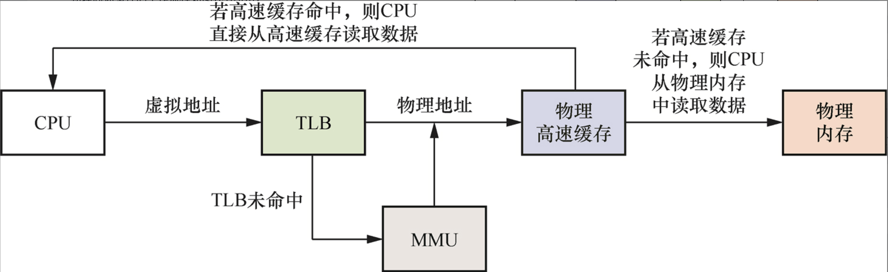

### 虚拟高速缓存

若处理器使用虚拟地址来寻址高速缓存，这种高速缓存就称为虚拟高速缓存。处理器在寻址时，首先把虚拟地址发送到高速缓存，若在高速缓存里找到需要的数据，就不再需要访问TLB和MMU。

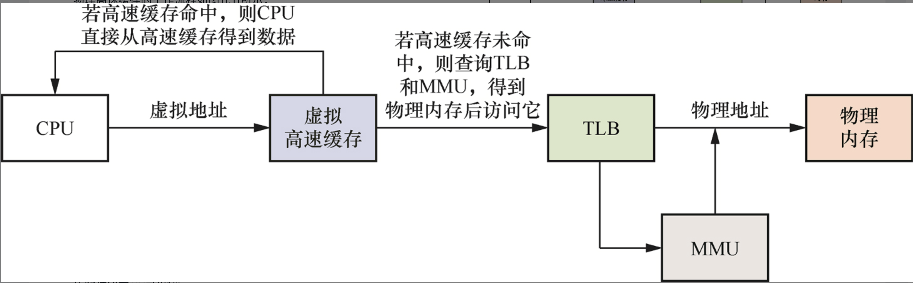

### 高速缓存的类型

在查询高速缓存时使用了索引域和标记域。

VIVT（Virtual Index Virtual Tag，虚拟索引虚拟标记）​：使用虚拟地址的索引域和虚拟地址的标记域，相当于虚拟高速缓存。

PIPT（Physical Index Physical Tag，物理索引物理标记）​：使用物理地址的索引域和物理地址的标记域，相当于物理高速缓存。

VIPT（Virtual Index Physical Tag，虚拟索引物理标记）​：使用虚拟地址的索引域和物理地址的标记域。

## 重名和同名问题

### 重名问题 (重复的名字)

虚拟高速缓存容易引入重名和同名的问题。

RISC-V体系结构从体系结构规范的角度约定：处理器微体系结构的实现不允许向软件暴露注入VIVT、VIPT之类的重名和同名问题。

在操作系统中，多个不同的虚拟地址可能映射到相同的物理地址。因为采用虚拟高速缓存，所以这些不同的虚拟地址会占用高速缓存中不同的高速缓存行，但是它们对应的是相同的物理地址，会引发歧义。这称为重名(aliasing)问题

+ 浪费高速缓存空间，造成高速缓存等效容量减少。
+ 在执行写操作时，只更新了其中一个虚拟地址对应的高速缓存，而其他虚拟地址对应的高速缓存并没有更新，因此处理器访问其他虚拟地址时可能得到旧数据。

### 同名问题 (相同的名字)

同名(homonyms)问题指的是相同的虚拟地址对应不同的物理地址。因为操作系统不同的进程中会存在很多相同的虚拟地址，而这些相同的虚拟地址在经过MMU转换后得到不同的物理地址，所以就产生了同名问题。

同名问题常出现在进程切换中。当一个进程切换到另一个进程时，若新进程使用虚拟地址来访问高速缓存，新进程会访问旧进程遗留下来的高速缓存，这些高速缓存数据对新进程来说是错误和没用的。进程 A 和进程 B 都使用了 0x50000 的虚拟地址，但是它们映射到的物理地址是不相同的。

解决办法是在进程切换时先使用 clean 命令把脏的缓存行的数据写回到内存中，然后使所有的高速缓存行都失效，这样就能保证新进程执行时得到“干净的”虚拟高速缓存。同样，需要使TLB无效，因为新进程在切换后会得到一个旧进程使用的TLB，里面存放了旧进程的虚拟地址到物理地址的转换结果。这对于新进程来说是无用的，因此需要把TLB清空。

**综上所述，重名问题是多个虚拟地址映射到同一个物理地址引发的问题，而同名问题是一个虚拟地址在进程切换等情况下映射到不同的物理地址而引发的问题。**

## 高速缓存策略

在处理器内核中，一条存储器读写指令经过取指、译码、发射和执行等一系列操作之后，首先到达LSU（Load Store Unit，加载存储单元）​。LSU包括加载队列(load queue)和存储队列(store queue)。LSU是指令流水线中的一个执行部件，是处理器存储子系统的顶层，是连接指令流水线和高速缓存的一个支点。存储器读写指令通过LSU之后，会到达一级缓存控制器。一级缓存控制器首先发起探测操作。对于读操作，发起高速缓存读探测操作并带回数据；对于写操作，发起高速缓存写探测操作。发起写探测操作之前，需要准备好待写的高速缓存行。探测操作返回时，将会带回数据。存储器写指令获得最终数据并进行提交操作之后，才会将数据写入。这个写入可以采用**直写(write through)模式**或者**回写(write back)模式**。

在上述的探测过程中，对于写操作，如果没有找到相应的高速缓存行，会出现写未命中(write miss)；否则，会出现写命中(write hit)。对写未命中的处理策略是写分配，即一级缓存控制器将分配一个新的高速缓存行，之后和获取的数据进行合并，然后写入一级缓存中。如果探测的过程是写命中的，那么在真正写入时有如下两种模式。

+ 直写模式：在进行写操作时，数据同时写入当前高速缓存、下一级高速缓存或主存储器中。直写模式可以降低高速缓存一致性的实现难度，其最大的缺点是会消耗比较多的总线带宽，性能和回写模式下的性能相比也有差距。

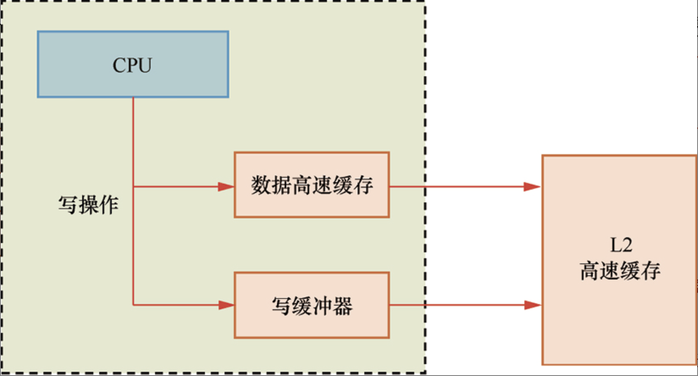

+ 回写模式：在进行写操作时，数据直接写入当前高速缓存，而不会继续传递，当该高速缓存行被替换出去时，被改写的数据才会更新到下一级高速缓存或主存储器中。该策略增加了高速缓存一致性的实现难度，但是有效减少了总线带宽需求。

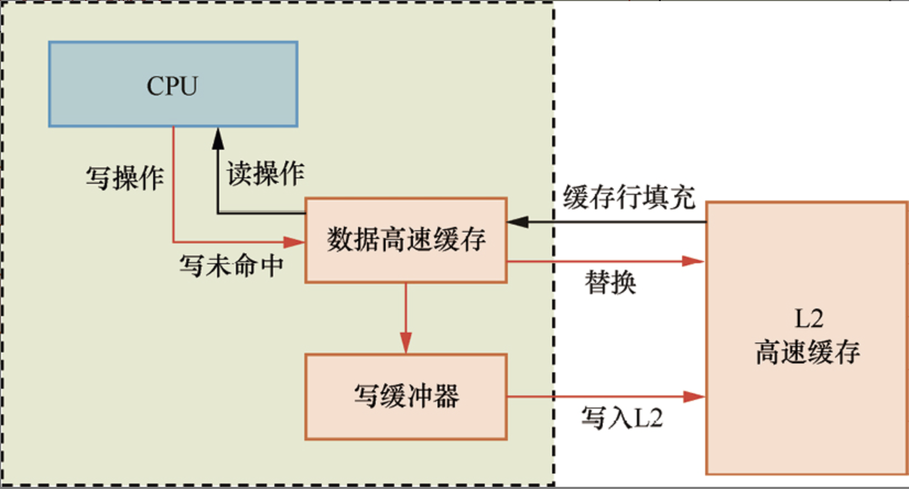

如果写未命中，那么也存在两种不同的策略。

+ 写分配(write-allocate)策略：先把要写的数据加载到高速缓存中，后修改高速缓存的内容。

+ 无写分配(no write-allocate)策略：不分配高速缓存，直接把内容写入内存中。

+ 对于读操作，如果命中高速缓存，那么直接从高速缓存中获取数据；如果没有命中高速缓存，那么存在如下两种不同的策略。

+ 读分配(read-allocate)策略：先把数据加载到高速缓存中，后从高速缓存中获取数据。

+ 读直通(read-through)策略：不经过高速缓存，直接从内存中读取数据。

高速缓存的替换策略有随机法、先进先出(First in First out, FIFO)法和最近最少使用(Least Recently Used, LRU)法。

随机法：随机地确定替换的高速缓存行，由一个随机数产生器产生随机数来确定替换行，这种方法简单、易于实现，但命中率比较低。

FIFO法：选择最先调入的高速缓存行并进行替换，最先调入的行可能被多次命中，但被优先替换，因而不符合局部性原理。

LRU法：根据各行使用的情况，始终选择最近最少使用的行并替换，这种算法较好地反映了程序的局部性原理。

## 高速缓存的维护指令

### 高速缓存管理指令

+ 失效(invalidate)操作：使某个高速缓存行失效，并丢弃高速缓存上的数据。

+ 清理(clean)操作：把标记为脏的某个高速缓存行写回下一级高速缓存或者内存中，然后清除高速缓存行中的脏位。这将使高速缓存行的内容与下一级高速缓存或者内存中的数据一致。

+ 冲刷(flush)操作：这是一种混合的操作，即清理并使其失效(clean andinvalidate)，它会先执行清理操作，然后使高速缓存行失效。

+ 清零(zero)操作：在某些情况下，用于对高速缓存进行预取和加速。例如，当程序需要使用较大的临时内存时，如果在初始化阶段对这块内存进行清零操作，高速缓存控制器就会主动把这些零数据写入高速缓存行中。若程序主动使用高速缓存的清零操作，那么将大大降低系统内部总线的带宽。

+ CBO.CLEAN指令

CBO.CLEAN指令用于对指定地址的高速缓存行执行清理操作。

```
cbo.clean rs1
```

其中，rs1表示虚拟地址，这条指令会清理rs1对应的高速缓存行。

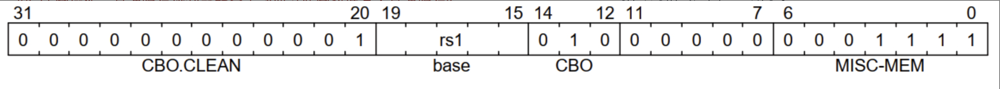

+ CBO.FLUSH指令

CBO.FLUSH指令用于对指定地址的高速缓存行执行冲刷操作。CBO.FLUSH指令的格式如下。

```
cbo.flush  rs1
```

其中，rs1表示虚拟地址，这条指令会冲刷rs1对应的高速缓存行。

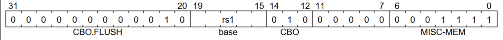

+ CBO.INVAL指令

CBO.INVAL指令用于使指定地址的高速缓存行无效。CBO.INVAL指令的格式如下。

```
cbo.inval  rs1
```

其中，rs1表示虚拟地址，这条指令会使rs1对应的高速缓存行无效。

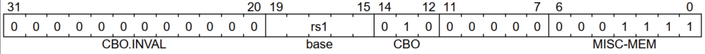

+ CBO.ZERO指令

CBO.ZERO指令用于对指定地址的高速缓存行执行清零操作。CBO.ZERO指令的格式如下。

```
cbo.zero  rs1
```

其中，rs1表示虚拟地址，这条指令会用零填充rs1对应的高速缓存行的内容。

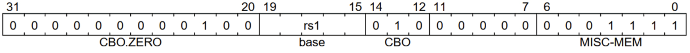

### 高速缓存预取指令

+ PREFETCH.I指令

`PREFETCH.I`指令用于预取指令高速缓存的数据，其格式如下。

```
prefetch.i offset(base)
```

其中，base为基地址，由rs1寄存器表示；offset为偏移量，它是12位宽的有符号立即数。

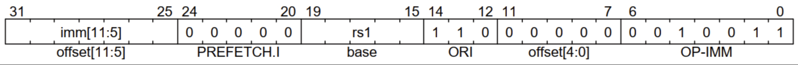

+ PREFETCH.R指令

PREFETCH.R指令用于在读操作中预取数据高速缓存的数据，其格式如下。

```
prefetch.r offset(base)
```

其中，base为基地址，由rs1寄存器表示；offset为偏移量，它是12位宽的有符号立即数。

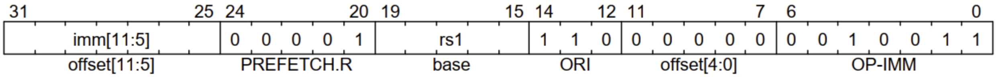

+ PREFETCH.W指令

PREFETCH.W指令用于在写操作中预取数据高速缓存的数据，其格式如下。

```
prefetch.w offset(base)
```

其中，base为基地址，由rs1寄存器表示；offset为偏移量，它是12位宽的有符号立即数。

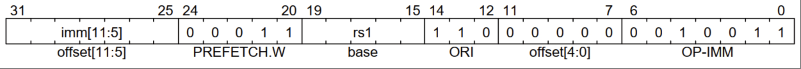

> 核心区别
> ```
> PREFETCH.R（读预取）:
> "我要读这个数据，请把它加载到Cache"
> → 只需要数据的副本，可以和其他CPU共享
> → 获取共享权限就够了
> 
> PREFETCH.W（写预取）:
> "我要写这个数据，请给我独占权"
> → 需要独占这个缓存行，不能有其他副本
> → 必须获取独占/修改权限
> ```


情况1：Index在Bit[11:0]内（安全）

```
假设Cache配置：
- 行大小：64字节
- 组数：64组
- Offset需要：log2(64) = 6位 → Bit[5:0]
- Index需要：log2(64) = 6位 → Bit[11:6]

地址划分：
Bit[31:12] - Tag
Bit[11:6]  - Index  ← 在页内偏移范围内
Bit[5:0]   - Offset

现在分析两个虚拟地址：

进程A：VA1 = 0xAAAA678
  Bit[11:0] = 0x678 = 0110 0111 1000
  Index = Bit[11:6] = 011001 = 0x19

进程B：VA2 = 0xBBBB678  
  Bit[11:0] = 0x678 = 0110 0111 1000  ← 相同！
  Index = Bit[11:6] = 011001 = 0x19  ← 相同！

因为两个虚拟地址的Bit[11:0]相同，
所以从中提取的Index也必然相同！

结果：
VA1 → Index=0x19 → Cache[0x19]
VA2 → Index=0x19 → Cache[0x19]
都映射到同一个Cache组！
→ 只有一份数据
→ 没有重名问题！✓
```

情况2：Index超出Bit[11:0]（危险）

```
假设Cache配置（更大）：
- 行大小：64字节  
- 组数：128组
- Offset需要：6位 → Bit[5:0]
- Index需要：7位 → Bit[12:6]  ← 超出页偏移了！

地址划分：
Bit[31:13] - Tag
Bit[12:6]  - Index  ← Bit[12]超出页内偏移！
Bit[5:0]   - Offset

现在分析两个虚拟地址：

进程A：VA1 = 0xAAAA678
  二进制：...1010 1010 1010 0110 0111 1000
  Bit[12:6] = 0001100 = 0x0C

进程B：VA2 = 0xBBBB678
  二进制：...1011 1011 1011 0110 0111 1000  
  Bit[12:6] = 1001100 = 0x4C  ← 不同！
              ↑
          Bit[12]不同了！

虽然Bit[11:0]相同（都是0x678），
但Index用到了Bit[12]，
Bit[12]属于VPN部分，所以Index不同！

结果：
VA1 → Index=0x0C → Cache[0x0C]
VA2 → Index=0x4C → Cache[0x4C]
同一个物理地址被存储在两个不同的组！
→ 两份数据
→ 重名问题！✗
```