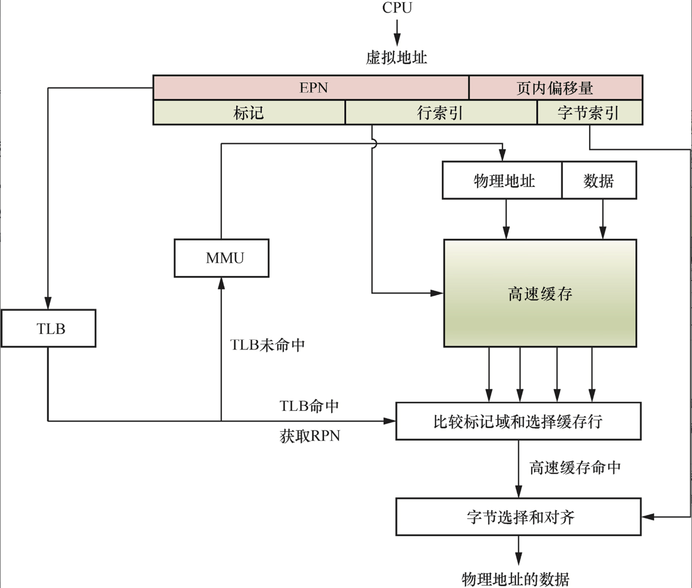
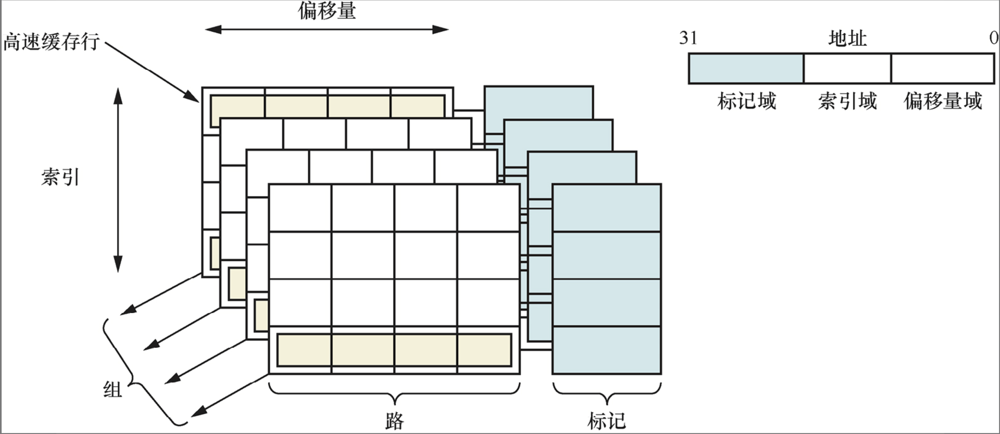

# 高速缓存

本章思考题
1. 为什么需要高速缓存？
2. 请简述CPU访问各级内存设备的延时情况。
3. 请简述CPU查询高速缓存的过程。
4. 请简述直接映射、全相联映射以及组相联映射的高速缓存的区别。
5. 在组相联高速缓存里，组、路、高速缓存行、标记域的定义分别是什么？
6. 什么是虚拟高速缓存和物理高速缓存？
7. 什么是高速缓存的重名问题？
8. 什么是高速缓存的同名问题?
9. VIPT类型的高速缓存会产生重名问题吗?
10. 高速缓存中的直写和回写策略有什么区别？

## 为什么需要高速缓存

当处理器第一次从内存中读取数据时，也会把该数据暂时缓存到这个缓冲区里。第二次读的时候，如果数据在高速缓存里，称为高速缓存命中(cache hit)；如果数据不在高速缓存里，称为高速缓存未命中(cache miss)。

L1 D表示L1数据高速缓存，L1 I表示L1指令高速缓存。

在现代广泛应用的计算机系统中，以内存为研究对象，体系结构可以分成两种：一种是均匀存储器访问(Uniform Memory Access, UMA)体系结构，另一种是非均匀存储器访问(Non- Uniform Memory Access,NUMA)体系结构。

UMA体系结构：内存有统一的结构并且可以统一寻址。目前大部分嵌入式系统、手机操作系统以及台式机操作系统采用的是UMA体系结构。最重要的一点是，它们可以通过系统总线访问DDR物理内存。

NUMA体系结构：系统中有多个内存节点和多个CPU节点，CPU访问本地内存节点的速度最快，访问远端内存节点的速度要慢一点。

## 高速缓存的工作原理

处理器访问主存储器使用地址编码方式。高速缓存也使用类似的地址编码方式。



处理器在访问存储器时会把虚拟地址同时传递给TLB和高速缓存。TLB是一个用于存储虚拟地址到物理地址的转换结果的小缓存，处理器先使用有效页帧号(Effective Page frame Number, EPN)在TLB中查找最终的实际页帧号(Real Page frame Number, RPN)，如果发生TLB未命中(TLB miss)，将会带来一系列严重的系统惩罚，处理器需要查询页表。假设发生TLB命中，就会很快获得合适的RPN，并得到相应的物理地址。同时，处理器通过高速缓存编码地址的索引域可以很快找到高速缓存行对应的组。但是这里高速缓存行中的数据不一定是处理器所需要的，因此有必要进行一些检查，将高速缓存行中存放的标记域和通过虚实地址转换得到的物理地址的标记域进行比较。如果相同并且状态位匹配，就会发生高速缓存命中，处理器通过字节选择与对齐(byteselect and align)部件可以获取所需要的数据。如果发生高速缓存未命中，处理器需要用物理地址进一步访问主存储器来获得最终数据，数据也会填充到相应的高速缓存行中。



+ 地址：处理器访问高速缓存时的地址编码分成3部分，分别是偏移量域、索引域和标记域。
+ 高速缓存行：高速缓存中最小的访问单元，包含一小段主存储器中的数据。常见的高速缓存行大小是32字节和64字节。
+ 索引(index)：高速缓存地址编码的一部分，用于索引和查找地址在高速缓存的哪组。
+ 路(way)：在组相联的高速缓存中，高速缓存分成大小相同的几个块。
+ 组(set)：由相同索引的高速缓存行组成。
+ 标记(tag)：高速缓存地址编码的一部分，通常是高速缓存地址的高位部分，用于判断高速缓存行缓存的数据的地址是否和处理器寻找的地址一致。
+ 偏移量(offset)：高速缓存行中的偏移量。处理器可以按字(word)或者字节(byte)寻址高速缓存行的内容。

```
通过地址中的Index字段直接计算！

┌──────────┬────────┬──────────┐
│   Tag    │ Index  │  Offset  │
└──────────┴────────┴──────────┘
              ↑
         这部分直接告诉你在哪个Set！
```

```
通过Tag比较来确定在哪个Way！

与Index不同（直接索引），Way需要【并行比较】所有可能的Way

步骤：
1. Index直接定位到Set（已完成）
2. 读出这个Set的所有Way
3. 用Tag与每个Way的Tag并行比较
4. 哪个Way的Tag匹配，就在那个Way
5. 如果都不匹配，就是Cache Miss
```

## 高速缓存的映射方式

根据组的高速缓存行数，高速缓存可以分为不同的映射方式。
+ 直接映射(direct mapping)。
+ 全相联映射(fully associative mapping)。
+ 组相联映射(set-associative mapping)。

### 直接映射

当每组只有一个高速缓存行时，高速缓存称为直接映射高速缓存。

### 全相联映射

若高速缓存里有且只有一组，即"主存中的任意一个地址，都可以与这n个缓存行中的任意一个对应"，则称为全相联映射，这又是一种极端的映射方式。**直接映射方式把高速缓存分成1路（块）​；而全相联映射方式则是另外一个极端，它把高速缓存分成n路，每路只有一个高速缓存行。**

图解说明

```
主存到缓存的映射
主存（例如4GB）：
┌─────────────┐
│ 地址 0x0000 │ ─┐
│ 地址 0x0001 │  │
│ 地址 0x0002 │  │  任意一个地址
│ 地址 0x0003 │  │  都可以去
│     ...     │  │  缓存的任意Way
│ 地址 0x1000 │  │
│ 地址 0x2000 │  │
│     ...     │  │
│ 地址 0xFFFF │ ─┘
└─────────────┘
        ↓
    都可以映射到
        ↓
全相联缓存（只有1个Set）：
┌────────────────────────────────────┐
│         Set 0（唯一的组）           │
│  Way0   Way1   Way2   ...   Way15  │
│ ┌────┬┌────┬┌────┬      ┌────┐    │
│ │可以││可以││可以│ ...  │可以│    │
│ │去这││去这││去这│      │去这│    │
│ └────┘└────┘└────┘      └────┘    │
└────────────────────────────────────┘

任何主存地址都可以选择16个Way中的任意一个
对比：组相联的限制
组相联缓存（8个Set，每个Set 2个Way）：

主存地址的映射：
┌────────────────────────────────────┐
│ 地址0x0000 (Index=0) → 只能去Set 0 │
│ 地址0x0040 (Index=1) → 只能去Set 1 │
│ 地址0x0080 (Index=2) → 只能去Set 2 │
│ ...                                │
│ 地址0x0100 (Index=0) → 只能去Set 0 │ ← 循环
└────────────────────────────────────┘

有限制！地址的Index决定了必须去哪个Set

Set内的2个Way可以选择：
              Way 0    Way 1
            ┌────────┬────────┐
Set 0       │ 可选   │ 可选   │ ← 但只能在这个Set内选
            └────────┴────────┘
```

### 组相联映射

为了解决直接映射高速缓存中的高速缓存颠簸问题，组相联的高速缓存结构在现代处理器中得到了广泛应用。

## 虚拟高速缓存与物理高速缓存

### 虚拟高速缓存

### 物理高速缓存

### 高速缓存的类型

## 重名和同名问题

## 高速缓存策略

## 高速缓存的维护指令

