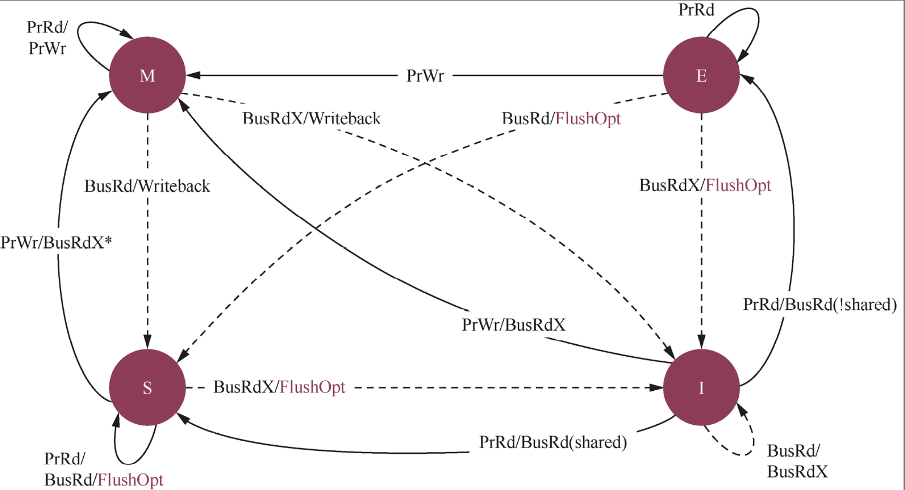
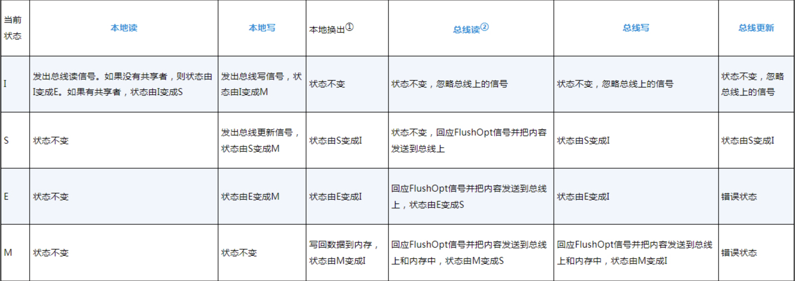

# 缓存一致性

本章思考题
1. 为什么会产生缓存一致性问题？
2. 缓存一致性的解决方案一般有哪些？
3. 为什么软件维护缓存一致性会在降低性能的同时增加功耗？
4. 什么是MESI协议？M、E、S、I这几个字母分别代表什么意思？
5. 假设系统中有4个CPU，每个CPU都有各自的一级高速缓存，处理器内部实现的是MESI协议，它们都想访问相同地址的数据a，大小为64字节，这4个CPU的高速缓存在初始状态下都没有缓存数据a。在T0时刻，CPU0访问数据a。在T1时刻，CPU1访问数据a。在T2时刻，CPU2访问数据a。在T3时刻，CPU3想更新数据a的内容。请依次说明T0～T3时刻4个CPU中高速缓存行的变化情况。
6. MOESI协议中的O代表什么意思？
7. 什么是高速缓存伪共享？请阐述高速缓存伪共享发生时高速缓存行状态的变化情况，以及软件应该如何避免高速缓存伪共享。
8. DMA和高速缓存容易产生缓存一致性问题。从DMA缓冲区（内存）到设备的FIFO缓冲区搬运数据时，应该如何保证缓存一致性？从设备的FIFO缓冲区到DMA缓冲区（内存）搬运数据时，应该如何保证缓存一致性？
9. 什么是自修改代码？自修改代码是如何产生缓存一致性问题的？该如何解决？

## 为什么会产生缓存一致性问题

缓存一致性关注的是同一个数据在多个高速缓存和内存中的一致性问题。解决高速缓存一致性的方法主要是使用总线监听协议，如MESI协议等。

缓存一致性根据系统设计的复杂度可以分成两大类。

+ 多核间的缓存一致性：通常指的是CPU簇内的处理器内核之间的缓存一致性。
+ 系统间的缓存一致性：包括CPU簇与簇之间的缓存一致性以及全系统（如CPU与GPU）间的缓存一致性。

解决缓存一致性问题，通常有3种方案。

+ 关闭高速缓存。
+ 使用软件维护缓存一致性。
+ 使用硬件维护缓存一致性。

监听控制单元(Snoop Control Unit, SCU)

高速缓存一致性协议主要有两大类别：一类是监听协议(snoopingprotocol)，每个高速缓存都要被监听或者监听其他高速缓存的总线活动；另一类是目录协议(directory protocol)，用于全局统一管理高速缓存状态。

MESI协议的名字源于该协议使用的修改(Modified, M)、独占(Exclusive, E)、共享(Shared, S)和无效(Invalid, I)4个状态。高速缓存行中有两个标志——脏(dirty)和有效(valid)。它们很好地描述了高速缓存和内存之间的数据关系

| 状态 | 说明 |
| ---- | ---- |
| M | 数据有效，数据已修改，和内存中的数据不一致，数据只存在于该高速缓存中 |
| E | 数据有效，数据和内存中的数据一致，数据只存在于该高速缓存中 | 
| S | 数据有效，数据和内存中的数据一致，多个高速缓存中有数据的副本 |
| I | 数据无效 |

MESI状态表示方法

| 状态 | 有效位 | 脏位 | 共享位 |
| --- | --- | ----- | ----- |
| M | 1 | 1 | 0 |
| E | 1 | 0 | 0 |
| S | 1 | 0 | 1 |
| I | 0 | 0 | 0 |



### 本地读写与总线读写操作

MESI协议在总线上的操作分为本地读写和总线读写操作。总线读写操作指的是某个CPU收到总线读或者写的请求信号，这个信号是远端CPU发出并广播到总线的；而本地读写操作指的是本地CPU读写本地高速缓存。

场景2: 总线读(Bus Read)
```
CPU0想读取地址X的数据:
1. 检查自己的缓存
2. 缓存中没有(缺失)
3. 向总线发出"BusRd X"请求 ← 这是"总线读"
4. 所有CPU都收到这个请求
5. CPU1发现自己有X的数据,通过总线回应
```



注：① 指的是本地换出(local eviction)高速缓存行。② 这里指在当前MESI状态下的高速缓存行收到总线读信号。

## 两种缓存一致性控制器

CCI缓存一致性控制器
高速缓存一致性网络(CacheCoherent Network, CCN)控制器

## 伪共享的避免

高速缓存伪共享的解决办法是让多线程操作的数据处在不同的高速缓存行。通常采用高速缓存行对齐(align)技术或者高速缓存行填充(padding)技术，让数据结构按照高速缓存行对齐，并且尽可能地填满一个高速缓存行。

+ 高速缓存行对齐 (Cache Line Alignment)
    核心思想：将数据结构的起始地址对齐到缓存行边界（通常是64字节）。
+ 高速缓存行填充 (Cache Line Padding)
    核心思想：在数据结构中添加额外的填充字节，使其占满整个缓存行或多个完整缓存行。

## DMA和高速缓存的一致性

在使用高速缓存维护指令来管理DMA缓冲区的缓存一致性时，需要思考如下两个问题。
+ 在启动DMA缓冲区之前，最新的数据源在CPU侧还是设备侧？
+ 在启动DMA缓冲区之前，DMA缓冲区对应的高速缓存中的数据是最新的还是过时的？

