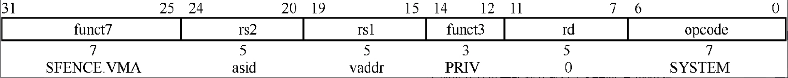

# TLB管理

本章思考题

1. 为什么需要TLB？
2. 请简述TLB的查询过程。
3. TLB是否会产生重名问题？
4. 什么场景下TLB会产生同名问题？如何解决？
5. 什么是ASID？使用ASID的好处是什么？
6. 在RISC-V体系结构中，刷新所有处理器的TLB的操作是如何实现的？
7. 为什么操作系统在切换页表项时需要刷新对应的TLB项？

## TLB基础知识

TLB是一个很小的高速缓存，专门用于缓存已经翻译好的页表项，一般存储在MMU内部。TLB项(TLB entry)的数量比较少，每项主要包含虚拟页帧号(Virtual Page frame Number, VPN)、物理页帧号(Physical page FrameNumber, PFN)以及一些属性等。

TLB相关属性

| 属性 | 描述 |
| ---- | --- |
| VPN | 虚拟页帧号 |
| PFN | 物理页帧号 |
| V | 有效位 |
| G | 表示是否有全局TLB或者进程持有的TLB |
| D | 脏位 |
| AP | 访问权限 |
| ASID | 进程地址空间ID |

## TLB重名与同名问题

TLB 不会有重名的问题。而TLB缓存中存放的是VA到PA的映射关系，
TLB 在进程切换时都会发生同名问题。解决办法是在进程切换时使旧进程遗留下来的TLB失效。

## ASID

+ 全局类型的TLB。内核地址空间是所有进程共享的空间，因此这部分空间的虚拟地址到物理地址的转换是不会变化的，可以理解为它是全局的。
+ 进程独有类型的TLB。用户地址空间是每个进程独立的地址空间。举个例子，在进程切换时，如从prev进程切换到next进程，TLB中缓存的prev进程的相关数据对next进程是无用的，因此可以刷新。

为了支持进程独有类型的TLB, RISC-V体系结构提供了一种硬件解决方案，叫作ASID。有了它，TLB可以识别TLB项属于哪个进程。ASID方案让每个TLB项包含一个ASID, ASID用于标识每个进程的地址空间，在原来以虚拟地址为判断条件的基础上，给TLB命中的查询标准加上ASID。有了ASID硬件机制的支持，进程切换不需要刷新TLB，即使next进程访问了相同的虚拟地址，prev进程缓存的TLB之间项也不会影响到next进程，因为ASID机制从硬件上保证了prev进程和next进程的TLB之间不会产生冲突。总之，ASID机制实现了进程独有类型的TLB。

**当系统中的ASID加起来超过硬件最大值时，会发生溢出，需要冲刷全部TLB，然后重新分配ASID。**

当为TLB添加ASID之后，要确定TLB是否命中就需要查询ASID。
+ 第一步，通过虚拟地址的索引域查找对应的TLB组。
+ 第二步，通过虚拟地址的标记域作比对。
+ 第三步，和satp寄存器中的ASID进行比较，若标记域和ASID以及相应的属性都匹配，则TLB命中，这是新增的步骤。

## TLB管理指令

**内存屏障功能**。这条指令保证了屏障之前的存储操作与屏障之后的读写操作的执行次序。这里主要指的是对虚拟内存管理中的相关数据的读写操作，例如，对页表的读写操作等。屏障之前的所有写操作以及屏障之后对虚拟内存管理的相关数据结构的读写操作（包括显式或者隐含的读写操作）的执行次序可以通过`SFENCE.VMA`指令保证。例如，处理器想切换整个页表（如修改satp寄存器的指向）​，然后访问某个页面对应的页表项内容，SFENCE.VMA指令可保证这两个操作之间的执行次序。如果这中间没有SFENCE.VMA指令，那么处理器可以乱序执行，即先读取该页面的页表项内容，然后再切换整个页表，从而导致处理器读取了旧的页表项内容。

**刷新TLB**。这条指令还会刷新本地处理器上与地址转换相关的高速缓存，如TLB等。如果对一个页表项进行了修改而没有刷新对应的TLB，那么处理器可能会访问旧的TLB项。

```asm
SFENCE.VMA rs1 rs2
```

`rs1`：用来指定虚拟地址，这条指令会对该虚拟地址对应的页表中的相关数据结构的读写操作进行排序。如果`rs1`指定的虚拟地址是一个无效地址，那么`SFENCE.VMA`指令的操作无效，但不会触发异常。

`rs2`：用来指定ASID，这条指令会使ASID对应进程的TLB无效。

``` c
sfence.vma rs1, rs2 的完整语义：

1. 内存屏障（Fence）：
   - 确保之前的页表写操作完成
   - 确保对所有CPU可见
   - 这是"排序"的部分

2. TLB失效（Invalidation）：
   - 清除指定的TLB条目
   - 这是"刷新"的部分
```



| 参数组合 | 描述 |
| ------- | ---- |
| rs1=x0和rs2=x0 | rs1=x0 表示对页表相关数据结构的所有读和写操作进行排序，这针对所有地址空间;rs2=x0表示会使所有地址空间中与地址转换相关的高速缓存（如TLB等）失效 |
| rs1=x0和rs2!=x0 | rs1=x0表示对页表相关数据结构的所有读和写操作进行排序，这特值ASID为rs2进程的地址空间 |
| rs1!=x0和rs2=x0 | rs1表示虚拟地址，这条指令会对这个虚拟地址对应页面的相关数据结构的所有读和写操作进行排序，这里仅仅针对该虚拟地址对应的所有地址空间。rs2=x0表示会使与所有地址空间的地址转换相关的高速缓存（如TLB等）失效 |
| rs1!=x0和rs2!=x1 | rs1表示虚拟地址，这条指令会对这个虚拟地址对应页表相关数据结构的所有读和写操作进行排序，这特指ASID为rs2的进程的地址空间。rs2表示进程的ASID，这条指令会使与该进程中rs1指定的虚拟地址所对应的地址转换相关的高速缓存天（如TLB等）失效 |

`SFENCE.VMA`指令隐含了内存屏障功能。如果在某个地址建立页表转换并执行了`SFENCE.VMA`指令，那么其后对这个地址的访问（如读操作）都是有效的。

### TLB广播

SFENCE.VMA指令只作用于本地处理器，如果在多处理器系统中刷新TLB，则需要使用TLB广播。

在RISC-V体系结构中实现TLB广播的步骤如下。
1. 在本地处理器中执行SFENCE.VMA指令。
2. 依次向系统中的其他处理器触发IPI。
3. 其他处理器在IPI处理函数中执行SFENCE.VMA指令。
4. 其他处理器发送信号给本地处理器，告知IPI处理已经完成。

RISC-V通常在SBI固件中实现TLB广播功能。操作系统通过`ECALL`调用OpenSBI提供的服务。OpenSBI提供了两个刷新进程TLB的接口。

`SBI_EXT_RFENCE_REMOTE_SFENCE_VMA`：用来刷新全部进程的TLB。
`SBI_EXT_RFENCE_REMOTE_SFENCE_VMA_ASID`：用来刷新指定进程的TLB。

### SFENCE.VMA指令使用场景

+ 当软件要更改进程的ASID时，首先把新的ASID设置到satp寄存器中，然后执行SFENCE.VMA指令，其中参数rs1=x0、rs2为新的ASID。

+ 如果处理器没有实现ASID或者使用数值为0的ASID，那么在更新satp寄存器时需要执行SFENCE.VMA指令，其中参数rs1=x0。

+ 如果软件修改了除PTE之外的页表项，那么需要执行SFENCE.VMA指令，其中参数rs1=x0。如果在任何一级页表项中设置了G位，那么参数rs2也必须设置为x0；否则，应该设置为进程对应的ASID。

+ 如果软件修改了页表项，那么需要执行SFENCE.VMA指令，其中参数rs1指向该页表项对应的虚拟地址。如果在页表项中设置了G位，那么将参数rs2设置为x0；否则，应该设置为进程对应的ASID。

> ASID只在少数情况需要刷新
> 
> 需要刷新的情况（少见）：
> 1. 更改进程的ASID（ASID池耗尽回收）  ← 很少发生
> 2. 进程退出（清理TLB）              ← 进程结束一次
> 3. 修改页表（页面换出/换入）         ← 针对特定页面

### BBM机制

BBM机制的工作流程如下。(1)使用一个失效的页表项来替换旧的页表项，执行一条内存屏蔽指令。(2)执行SFENCE.VMA指令来刷新对应的TLB。发送IPI中断到其他CPU上，让其他CPU也刷新TLB。(3)写入新的页表项，执行内存屏障指令，保证写入操作被其他CPU观察者看到。