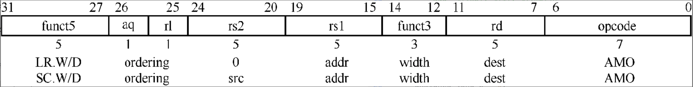
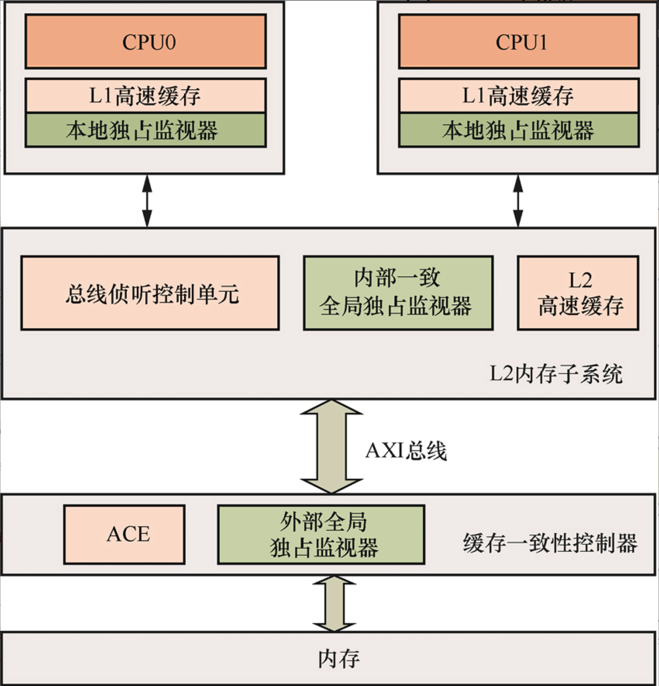
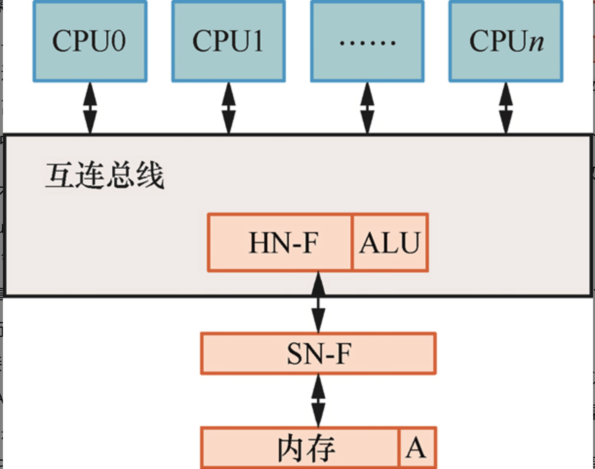

# 原子操作

本章思考题

1. 什么是原子操作？
2. 什么是LL/SC机制？
3. 在RISC-V处理器中，如何调用LR/SC指令？
4. 如果多个核同时使用LR和SC指令对同一个内存地址进行访问，如何保证数据的一致性？
5. 什么是CAS指令？CAS指令在操作系统编程中有什么作用？

## 原子操作介绍

**原子操作是指保证指令以原子的方式执行，执行过程不会被打断。**

## 保留加载与条件存储指令

RISC-V指令集中的A扩展指令集提供两种方式来实现原子操作：一种是经典的LR与SC指令。

```
lr.w rd, (rs1)
lr.d rd, (rs1)
```

>注：没有立即数偏移字段。

其中，w表示加载4字节数据；d表示加载8字节数据；rs1表示源地址寄存器；(rs1)表示以rs1寄存器的值为基地址进行寻址，简称rs1地址；rd表示目标寄存器。

LR指令从rs1地址处加载4字节或者8字节的数据到rd寄存器中，并且注册一个保留集(reservation set)，这个保留集包含rs1地址。

> 为这个地址建立保留

SC指令有条件地把数据写入内存。

```
sc.w rd, rs2, (rs1)
sc.d rd, rs2, (rs1)
```

它会有条件地把rs2寄存器的值存储到rs1地址中，把执行的结果反映到rd寄存器中。若rd寄存器的值为0，说明SC指令执行完毕，数据已经写入rs1地址中。如果结果不为0，说明SC指令执行失败，需要跳转到LR指令处，重新执行原子加载以及原子存储操作。不管SC指令执行成功还是失败，保留集中的数据都会失效。



LR和SC指令是需要配对使用的，其中SC指令执行成功的条件有两个，一是当前保留集有效，二是保留集中包含的数据被成功更新或者写入。**无论SC指令执行成功与否，当前CPU包含的保留集都会失效。**

RISC-V架构对LR/SC序列做了一些约束，不符合这些约束的LR/SC序列不能保证在所有RISC-V处理器中都能执行成功。
(1)LR/SC的循环遍历中最多包含16条指令。
(2)LR/SC序列包括RV64I指令或者压缩指令，但是不包括加载、存储、向后跳转、向后分支、JALR、FENCE、以及SYSTEM指令。
(3)LR/SC序列可以包含向后跳转并重试指令。
(4)SC指令的地址必须与同一个CPU执行的最新LR指令的有效地址和数据大小相同。

## 独占内存访问工作原理

### 独占监视器

独占监视器会把对应的内存地址标记为独占访问模式，保证以独占的方式访问这个内存地址，不受其他因素的影响。而SC则是有条件的存储指令，它会把新数据写入LR指令标记独占访问的内存地址里。

当CPU通过LR指令从内存中加载数据时，CPU会把这个内存地址标记为独占访问，然后CPU内部的独占监视器状态变成独占访问状态。当CPU执行SC指令的时候，需要根据独占监视器的状态做决定。如果独占监视器的状态为独占访问状态，并且SC指令要存储的地址正好是刚才使用LR指令标记过的，那么SC指令存储成功，SC指令返回0，独占监视器的状态变成开放访问状态。如果独占监视器的状态为开放访问状态，那么SC指令存储失败，SC指令返回1，独占监视器的状态不变，依然为开放访问状态。

**当CPU通过LR指令从内存中加载数据时，CPU会把这个内存地址标记为独占访问，然后CPU内部的独占监视器状态变成独占访问状态。当CPU执行SC指令的时候，需要根据独占监视器的状态做决定。**

**如果独占监视器的状态为独占访问状态，并且SC指令要存储的地址正好是刚才使用LR指令标记过的，那么SC指令存储成功，SC指令返回0，独占监视器的状态变成开放访问状态。**

**如果独占监视器的状态为开放访问状态，那么SC指令存储失败，SC指令返回1，独占监视器的状态不变，依然为开放访问状态。**



+ **本地独占监视器(local exclusive monitor)：处于处理器的L1内存子系统中。L1内存子系统支持独占加载、独占存储、独占清除等同步原语。**
+ **内部一致全局独占监视器(internal coherent global exclusive monitor)：利用多核处理器中与L1高速缓存一致性相关的信息来实现独占监视。**
+ **外部全局独占监视器(external global exclusive monitor)：通常位于芯片的内部总线中，例如，AXI总线支持独占的读操作和独占的写操作。当访问设备类型的内存地址或者访问内部共享但是没有使能高速缓存的内存地址时，我们就需要用到这种外部全局独占监视器。缓存一致性控制器通常支持这种独占监视器。**

### 独占监视器与缓存一致性

LR指令和SC指令在多核之间利用高速缓存一致性协议以及独占监视器来保证执行的串行化与数据一致性。

### 原子内存访问操作指令

RISC-V指令集中的A扩展指令集提供原子内存访问操作指令，它允许在靠近数据的地方原子地实现“读-修改-写回”操作。

原子内存访问操作指令工作原理

+ 近端原子(near atomic)操作：如果数据已经在CPU的高速缓存里，那么可以在CPU内部实现原子内存操作。还有一种特殊情况，如果有些系统的总线不支持远端原子操作传输事务，那么只能实现近端原子操作。
+ 远端原子(far atomic)操作：**在内存或者系统总线上实现原子内存操作**，这种情况下，需要系统总线支持原子操作传输事务。



### RISC-V中的原子内存访问指令

原子内存访问指令实现“读-修改-写回”的操作，其格式如下。

```
amo<op>.w/d  rd, rs2, (rs1)
```

+ op：表示操作后缀。
    | 操作后缀 | 说明 |
    | ------- | ----- |
    | swap | 交换 |
    | add | 加法运算 |
    | and | 与操作 |
    | or | 或操作 |
    | xor | 异或操作 |
    | max | 求有符号数的最大值 |
    | maxu| 求无符号数的最大值 |
    | mix | 求有符号数的最小值 |
    | mixu | 求无符号数的最小值 |
+ w：表示操作数的位宽为32位。
+ d：表示操作数的位宽为64位。
+ rd：表示目标寄存器，指令执行的结果将写入该寄存器中。
+ rs2：表示源操作数。
+ rs1：表示源地址寄存器。
+ θ(rs1)：表示以rs1寄存器的值为基地址进行寻址。

## 比较并交换指令

比较并交换(CAS)指令在无锁(lock-free)实现中有着非常重要的作用。

CAS操作的基本思路是检查指针ptr指向的值与expected是否相等。若相等，则把new的值赋给ptr；否则，什么也不做。不管是否相等，最终都会返回ptr的旧值，让调用者判断该CAS指令是否执行成功。

| 函数变体               | 内存屏障原语说明                         |
|------------------------|------------------------------------------|
| `cmpxchg_acquire`      | 比较并交换操作，隐含了**加载-获取**内存屏障原语 |
| `cmpxchg_release`      | 比较并交换操作，隐含了**存储-释放**内存屏障原语 |
| `cmpxchg_relaxed`      | 比较并交换操作，**不隐含**任何内存屏障原语 |
| `cmpxchg`              | 比较并交换操作，隐含了**加载-获取**和**存储-释放**内存屏障原语 |

**LR/SC指令操作期间会监视所有对保留地址的写操作，而不仅是某个内存地址的值**
