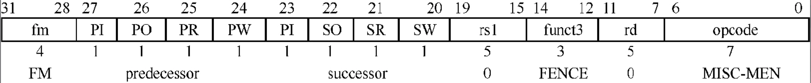

# 内存屏障指令

本章思考题

1. 产生内存乱序访问的原因是什么？
2. 什么是顺序一致性内存模型？
3. 什么是处理器一致性内存模型？
4. 什么是弱一致性内存模型？
5. 请列出3个需要使用内存屏障指令的场景。
6. 什么是加载-获取内存屏障原语？什么是存储-释放内存屏障原语？
7. 当多个线程正在使用同一个页表项时，如果需要更新这个页表项的内容，如何保证这些线程都能正确访问更新后的页表项？
8. 请说出3个RSIC-V内存屏障的约束条件。
9. 请简述FENCE.I指令与SFENCE.VMA指令的作用和使用场景。

## 产生内存屏障指令的原因

+ 程序次序(Program Order, PO)：程序代码里指定的内存访问序列。
+ 内存次序(Memory Order, MO)：站在内存角度看到的内存访问序列，也是系统所有处理器达成一致的内存操作总序列。

内存乱序访问主要发生在如下两个阶段。

+ 编译阶段。编译器优化导致内存乱序访问。
+ 执行阶段。多个CPU的交互引起内存乱序访问。

### 顺序一致性内存模型

内存一致性模型：规定了在多核环境下，内存操作的顺序是什么样的。
通俗一点讲内存一致性就是指一个CPU核上的内存修改操作，在什么时候可以在其它核上反映出来（比如通过一个读操作）

一致性就是：多个CPU对同一个内存的看法要一致

想到使用一个全局时间尺度(global time scale)部件来决定存储器访问时序，从而判断最近访问的数据。这种访问的内存一致性模型是严格一致性(strict consistency)内存模型，也称为原子一致性(atomic consistency)内存模型。

采用每一个处理器的局部时间尺度(local time scale)部件来确定最新数据的内存模型称为顺序一致性(Sequential Consistency,SC)内存模型。

+ 从单处理器角度看，存储器访问的执行次序以程序次序为准。
+ 从多处理器角度看，所有的内存访问都是原子性的，其执行顺序不必严格遵循时间顺序。

> 所有CPU看到的执行顺序可以不同，但在每个CPU看到的顺序中，单个CPU的执行顺序必须保持一致！

### 处理器一致性内存模型

处理器一致性(Processor Consistency, PC)内存模型是顺序一致性内存模型的进一步弱化，放宽了对较早的写操作与后续的读操作之间的次序要求，即放宽了“写→读”操作的次序要求。处理器一致性内存模型允许加载指令从存储缓冲区(store buffer)中读取一条还没有执行的存储指令的值，前提是这个值还没有被写入高速缓存中。

> 处理器一致性只要求同一地址的写顺序一致, 所有CPU必须以相同的顺序看到对同一个地址的写操作

### 弱一致性内存模型

弱一致性内存模型弱一致性(Weak Consistency, WC)内存模型是对处理器一致性内存模型的进一步弱化，可以放宽对“读→读”​“读→写”​“写→写”​“写→读”4种情况的执行次序要求，不过这并不意味着程序就不能得到正确的预期结果。其实在这种情况下，程序只需要添加适当的同步操作。

对内存的访问可以分成如下几种方式。

+ 共享访问：多个处理器同时访问同一个变量，都执行读操作。
+ 竞争访问：多个处理器同时访问同一个变量，其中至少有一个执行写操作，因此存在竞争访问。

在程序中适当添加同步操作可以避免竞争访问的发生。与此同时，在同步点之后，处理器可以放宽对存储访问操作的次序要求，因为这些访问次序是安全的。基于这种思路，存储器访问指令可以分成数据访问指令和同步指令（也称为内存屏障指令）两大类，对应的内存模型称为弱一致性内存模型。

在多处理器系统中，满足如下3个条件的内存访问称为弱一致性内存访问。

+ 对全局同步变量的访问是顺序一致的。
+ 在一个同步访问操作（例如，发出内存屏障指令）可以执行之前，以前的所有数据访问操作必须完成。
+ 在一个正常的数据访问操作（如数据访问指令）可以执行之前，以前的所有同步访问操作（内存屏障指令）必须执行完。

弱一致性内存模型实质上是对同步访问和普通内存访问进行区分，然后通过同步访问操作（如发出内存屏障指令）解决共享数据的竞争问题，保证多处理器对共享数据的访问是顺序一致性的。

### 释放一致性内存模型

在弱一致性内存模型的基础上新增了“获取”(acquire)和“释放”(release)屏障原语，用于简化共享数据的互斥访问。

获取屏障原语之后的读/写操作不能重排到该屏障原语之前，该屏障原语通常和加载指令或者原子操作指令结合使用。释放屏障原语之前的读/写操作不能重排到该屏障原语之后，该屏障原语通常和存储指令结合使用。获取屏障原语与释放屏障原语之间是顺序执行的。

**规则**：
- ACQUIRE**之后**的操作，不能移到ACQUIRE**之前**
- ACQUIRE**之前**的操作，可以移到ACQUIRE**之后**（向下穿越）
- RELEASE**之前**的操作，不能移到RELEASE**之后**
- RELEASE**之后**的操作，可以移到RELEASE**之前**（向上穿越）

### MCA模型

MCA（Multi-Copy Atomicity，多副本原子性）模型也称为写原子性(write atomicity)模型，指的是在多核处理器系统中，如果一个本地写操作被其他任意一个观察者（如其他CPU）观察到写入完成，那么系统中所有的观察者都能观察到写入完成。

与MCA模型对应的是Non-MCA(Non- Multi-CopyAtomic)模型。Non-MCA模型不能保证处理器的写操作立即被其他观察者观察到，这会导致系统变得复杂。

+ 如果对相同地址的写操作是串行的，那么对于所有的观察者来说，它们都能观察到相同的写入序列。
+ 当所有观察者都观察到写操作完成之后，读操作才能读出最新的值。

## RVWMO内存模型中的一些约束条件

RISC-V支持两种内存模型，一种名为RVWMO(RISC-VWeak Memory Ordering)，另一种名为RVTSO(RISC-VTotal Store Ordering)。RVWMO是基于释放一致性内存模型以及MCA模型构建的，提供相对宽松的内存访问约束条件，简化了处理器设计并提升了处理器性能。

### 全局内存次序与保留程序次序

在RVWMO中有两个概念，全局内存次序(global memoryorder)以及保留程序次序(preserved program order)。全局内存次序指的是站在内存角度看到的读和写操作的次序。保留程序次序指的是在全局内存次序中必须遵守的一些与内存次序相关的规范和约束。

### RVWMO的约束规则

RVWMO规范约定了处理器需要遵守的13条规则。除这些约束规则之外，处理器可以对程序次序进行重排并乱序执行。

规则1：如果指令a和指令b访问相同或者重叠的内存地址，指令b执行存储操作，那么指令a必须先于指令b执行。

规则2：对同一个地址（或者重叠地址）的加载-加载操作。基本要求是新加载操作返回的值不能比旧加载操作返回的值“老”​，这称为CoRR(Coherencefor Read-Read pairs)。

规则3: a是原子内存操作(AMO)指令或者SC指令，b是加载指令，b返回的值是a写入的值，即a和b访问相同的地址。如果加载指令b返回的值是AMO或者SC指令a写入的值，那么在指令a执行完之前不能返回值给指令b。

规则4：如果指令a和指令b之间有内存屏障指令，a和b的执行次序需要遵循内存屏障指令的规则。

规则5：指令a内置了获取内存屏障原语，如获取内存屏障指令。如果指令a.aq表示内置了获取内存屏障原语，那么指令b则不能重排到指令a.aq前面

规则6：指令b内置了释放内存屏障原语，如释放内存屏障指令。指令b.rl内置了释放内存屏障原语，则指令1不能重排到指令b.rl的后面

规则7：指令a与指令b分别内置了获取与释放内存屏障原语。指令a.aq和指令b.rl形成了一个临界区，临界区内的指令不能向前或者向后越过临界区。

规则8：在LR和SC指令组成的原子操作中，LR和SC指令的执行次序必须保持一致

规则9：指令b和指令a之间存在地址依赖(addressdependency)。地址依赖指的是指令b寻址的内存地址源自指令a的计算结果。

规则10：指令b和指令a之间存在数据依赖(datadependency)。数据依赖指的是指令b的参数来自指令a的结果。

规则11：指令b和指令a之间存在控制依赖(controldependency)。控制依赖指的是根据指令a的结果选择不同的分支，从而控制指令b是否运行。

规则12：如果指令a和指令b之间有一个写操作m，指令b执行加载操作，指令m和指令a之间存在地址依赖或者数据依赖，指令b和指令m访问同一个地址，那么指令b返回的值必须是指令m写入的值。

规则13：指令a和指令b之间有一条指令m，指令b执行存储操作，指令m和指令a之间存在地址依赖。

## RISC-V中的内存屏障指令

### FENCE指令

RISC-V提供了一条通用的内存屏障指令FENCE，该指令可以对I/O设备和普通内存的访问进行排序。

```
fence  iorw,  iorw
```

FENCE指令一共有两个参数，分别表示要约束的前后指令的类型，i 表示设备输入类型的指令，o表示设备输出类型的指令，r表示内存读类型的指令，w表示内存写类型的指令。



+ MISC-MEM：表示指令的操作码字段。
+ FENCE：表示指令的功能字段。
+ rs1和rd：保留。successor：表示在内存屏障指令后面的指令约束类型，包括i、o、r和w这4种类型。
+ predecessor：表示在内存屏障指令前面的指令约束类型，包括i、o、r和w这4种类型。
+ FM：表示FNECE指令的类型。
    ◇ fm=0000：表示普通的FENCE指令。
    ◇ fm=1000, predecessor=RW, successor=RW：表示FENCE.TSO指令。

> 保证：栅栏前的所有操作都在栅栏后的所有操作之前

### 内置获取和释放内存屏障原语的指令

RISC-V指令在原子操作指令中提供内置的获取和释放内存屏障原语的变种指令，如LR/SC和AMO指令。在指令后面添加“.AQ”​“.RL”​“.AQRL”表示内置获取与释放内存屏障原语。

+ “.AQ”表示该指令内置了获取内存屏障原语，后续的读/写指令都不在该指令之前执行。
+ “.RL”表示该指令内置了释放内存屏障原语，前面的读/写指令都在该指令前执行完，例如SC.D.RL指令。
+ “.AQRL”表示同时内置了获取和释放内存屏障原语，前面的读/写指令在本指令之前执行，后面的读写指令在本指令之后执行。

### FENCE.I指令

FENCE.I指令用于在同一个CPU中的高速缓存指令与预取指令之间的同步原语。简单来说，这条指令的目标是确保存储指令在对CPU可见的同时，预取的指令也对CPU可见，即在同一个CPU中后续预取的指令可以看到屏障前面的存储操作已经完成。

FENCE.I指令仅对本地CPU有效，如果需要让其他CPU也生效，则需要通过IPI通知其他CPU也执行FENCE.I指令。FENCE.I指令的格式如下。

### SFENCE.VMA指令

为了保证这些内存操作能够正确执行，需要约束它们的内存访问顺序。

sfence.vma 用于刷新 TLB（Translation Lookaside Buffer），即页表缓存。


| API函数            | 说明                                | RISC-V中的实现          |
|--------------------|-------------------------------------|------------------------|
| smp_mb             | 用于SMP环境下的读/写内存屏障指令      | fence rw,rw            |
| smp_rmb            | 用于SMP环境下的读内存屏障指令         | fence r,r              |
| smp_wmb            | 用于SMP环境下的写内存屏障指令         | fence w,w              |
| dma_rmb            | 用于I/O设备的读内存屏障               | fence r,r              |
| dma_wmb            | 用于I/O设备的写内存屏障               | fence w,w              |
| mb                 | 单处理器系统版本的读/写内存屏障指令    | fence iorw,iorw        |
| rmb                | 单处理器系统版本的读内存屏障指令       | fence ri,ri            |
| wmb                | 单处理器系统版本的写内存屏障指令       | fence wo,wo            |
| smp_load_acquire   | 用于SMP环境下带获取内存屏障的加载操作  | l(b\|h\|w\|d); fence r,rw |
| smp_store_release  | 用于SMP环境下带释放内存屏障的存储操作  | fence rw,w; s(b\|h\|w\|d) |
| atomic_<op>_relaxed    | 原子操作                  | 采用AMO指令amo<p>.{w\|d}、采用LR/SC指令loop: lr.{w\|d};<br><p>;<br>sc.{w\|d};<br>bnez loop |
| atomic_<op>_acquire    | 带获取内存屏障的原子操作   | 采用AMO指令amo<p>.{w\|d}.aq、采用LR/SC指令loop: lr.{w\|d}.aq;<br><p>;<br>sc.{w\|d};<br>bnez loop |