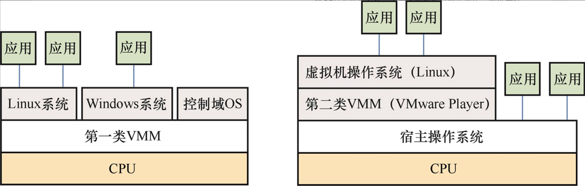
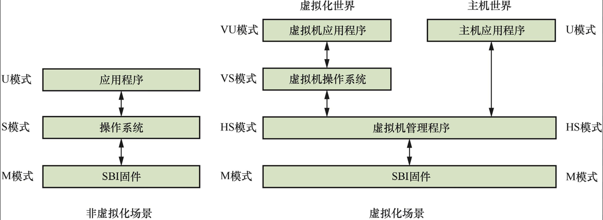
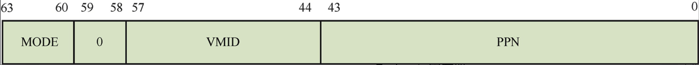
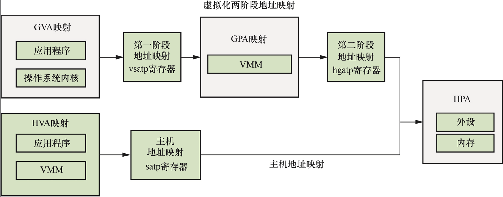
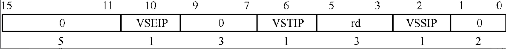
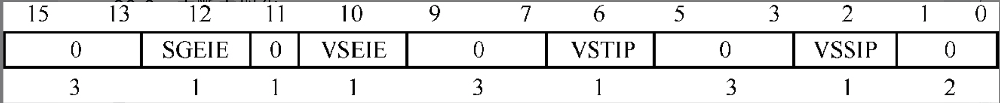
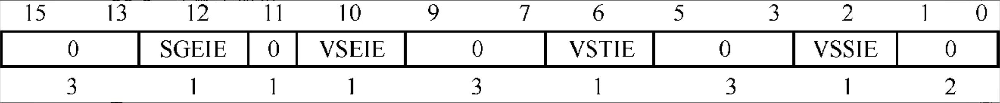

# 虚拟化扩展

本章思考题
1. 实现虚拟化的3个要素是什么？
2. 什么是GVA、GPA、HVA和HPA？
3. RISC-V在CPU虚拟化中做了哪些改进？
4. 处于HS模式下的处理器能访问哪些系统寄存器？
5. 请简述虚拟化场景中两阶段地址映射的过程。
6. RISC-V为虚拟化新增的HLV/HSV指令有什么用途？
7. 在RISC-V虚拟化扩展中，VMM如何进入虚拟机？
8. 在RISC-V虚拟化扩展中，VM有哪些途径可以陷入VMM？
9. 在RISC-V虚拟化扩展中，如何把一个中断注入VM？
10. 在虚拟化场景中，什么是“陷入与模拟”机制？

**平台虚拟化(platform virtualization)：针对计算机和操作系统的虚拟化，如KVM等。**

**资源虚拟化(resource virtualization)：针对特定系统资源的虚拟化，包括内存、存储器、网络资源等，如容器技术。**

**应用程序虚拟化(application virtualization)：针对应用程序的虚拟化，包括仿真、模拟、解释技术等，如Java虚拟机。**

## 虚拟化技术介绍

虚拟化的主要思想是利用虚拟机监控程序(Virtual MachineMonitor, VMM)在同一物理硬件上创建多个虚拟机，这些虚拟机运行时就像真实的物理机器一样。虚拟机监控程序又被称为虚拟机管理程序(hypervisor)。

### 虚拟化技术的发展历史

+ 资源控制(resource control)。VMM必须能够管理所有的系统资源。
+ 等价性(equivalence)。虚拟机的运行行为与裸机的运行行为一致。
+ 效率性(efficiency)。虚拟机运行的程序不受VMM干涉。

### 虚拟机管理程序的分类

第一类VMM就像小型操作系统，目的是管理所有的虚拟机，常见的虚拟化软件有Xen、Xvisor等。

第二类VMM依赖Windows、Linux等操作系统来分配和管理调度资源，常见的虚拟化软件有VMware Player、KVM以及Virtual Box等。



### 内存虚拟化

+ GVA(Guest Virtual Address)：虚拟机虚拟地址。
+ GPA(Guest Physical Address)：虚拟机物理地址。
+ HVA(Host Virtual Address)：主机虚拟地址。
+ HPA(Host Physical Address)：主机物理地址。

对于虚拟机的应用程序来说，访问具体的物理地址需要两次页表转换，即从GVA到GPA以及从GPA到HPA。

### I/O虚拟化

+ 使用软件模拟设备。以磁盘为例，VMM可以在实际的磁盘上创建一个文件或一块区域来模拟虚拟磁盘，并把它传递给虚拟机。
+ 使用设备透传(device pass through)。VMM把物理设备直接分配给特定的虚拟机。
+ 使用SR-IOV（Single Root I/O Virtualization，单根I/O虚拟化）技术。设备透传方式的效率很高，但是可伸缩性很差。如果系统只有一块FPGA（Field ProgrammableGate Array，现场可编程门阵列）加速设备卡，就只能把这个设备传给一个虚拟机，当多个虚拟机都需要FPGA加速设备时，设备透传方式就显得无能为力了。支持SR-IOV技术的设备可以为每个使用这个设备的虚拟机提供独立的地址空间、中断和DMA等。SR-IOV提供两种设备访问方式。

    ◇ PF（Physical Function，物理功能）​：提供完整的功能，包括对设备的配置，通常在宿主机上访问PF设备。
    ◇ VF（Virtual Function，虚拟功能）​：提供基本的功能，不提供配置选项，但是可以把VF设备传递给虚拟机。

为了解决这个问题，人们引入了IOMMU（InputOutput Memory Management Unit，输入/输出内存管理单元）​。IOMMU类似于CPU中的MMU，只不过IOMMU用来将设备访问的虚拟地址转换成物理地址。因此，在虚拟机场景下，IOMMU能够根据GPA和HPA的转换表重新建立映射，从而避免虚拟机的外设在进行DMA时影响到虚拟机以外的内存，这个过程称为DMA重映射。IOMMU的另外一个好处是实现了设备隔离，从而保证设备可以直接访问分配到的虚拟机内存空间而不影响其他虚拟机的完整性，这类似于MMU，它能防止进程的错误内存访问从而影响到其他进程。

## RISC-V虚拟化扩展

目前虚拟化扩展主要包括CPU虚拟化扩展、内存虚拟化扩展以及中断虚拟化扩展等方面。

### CPU虚拟化扩展

+ S模式的扩展。把原有的S模式扩展为HS(Hypervisor-extended Supervisor)模式，它可以运行VMM，也可以运行主机操作系统，从而完美、无缝地支持第一类VMM以及第二类VMM，如Xvisor和KVM。HS模式在原来S模式的基础上新增了一些指令以及系统寄存器。
+ 新增处理器模式。新增了VS(virtual S)模式和VU(virtualU)模式，虚拟机操作系统运行在VS模式，虚拟机应用程序运行在VU模式。处理器模式的变化如图所示。HS模式比VS模式拥有更高的资源管理权限，同理，VS模式比VU模式拥有更高的资源管理权限。



### 虚拟化扩展在系统寄存器方面做了如下扩展。

+ 对M模式的部分系统寄存器做了扩展。
+ 在HS模式下新增了系统寄存器。运行在HS模式的VMM除使用S模式下原有的系统寄存器处理异常、中断、地址转换等功能之外，还新增了一系列在虚拟化场景下使用的系统寄存器，如hstatus、hedeleg等。
+ 新增VS模式的系统寄存器。使用V来表示处理器是否运行在虚拟化模式。

若V=1，表示处理器运行在虚拟化模式，即在VS模式或者VU模式下；若V=0，表示处理器运行在非虚拟化模式，如M模式、HS模式或者U模式。另外，使用如下缩写表示不同模式下的系统寄存器。

+ m<csr>表示M模式下的系统寄存器。
+ s<csr>表示S模式下的系统寄存器。
+ h<csr>表示HS模式下的系统寄存器。
+ vs<csr>表示VS模式下的系统寄存器。

| 当前模式 | 访问的寄存器 | 实际访问的寄存器 | 说明 |
|----------|--------------|------------------|------|
| **HS模式** | `s<csr>` | 原S模式系统寄存器 | 直接访问Supervisor模式的寄存器 |
| **HS模式** | `h<csr>` | HS模式专用寄存器 | 访问Hypervisor扩展的寄存器 |
| **HS模式** | `vs<csr>` | VS模式系统寄存器 | 访问虚拟Supervisor模式的寄存器 |
| **VS模式** | `s<csr>` | `vs<csr>`寄存器 | 自动重定向到虚拟Supervisor寄存器 |

**mstatus寄存器**

mstatus寄存器在原来的基础上新增了两个字段

| 字段 | 位段 | 含义 | 取值说明 |
|------|------|------|----------|
| **GPV** | Bit[38] | 陷入原因标识 | **=1**：断点/非对齐/访问异常/虚拟机缺页<br>**=0**：其他异常原因 |
| **MPV** | Bit[39] | 陷入前虚拟化状态 | **=1**：陷入前 V=1 (VS/VU模式)<br>**=0**：陷入前 V=0 (M/HS/U模式) |


另外，在虚拟化扩展中，MPRV字段(Bit[17])的行为略有改变。若MPRV=0，表示加载/存储指令按照当前的处理器模式进行地址转换与内存保护。若MPRV=1，则表示加载/存储指令按照MPP字段设置的处理器模式以及MPV字段设置的虚拟化模式进行地址转换与内存保护

**mip和mie寄存器**

mip寄存器在原来的基础上新增了SGEIP、VSEIP、VSTIP以及VSSIP字段，它们分别对应hip寄存器中相应的字段。

mie寄存器在原来的基础上新增了SGEIE、VSEIE、VSTIE以及VSSIE字段，它们分别对应hie寄存器中相应的字段。

| MPRV字段 | MPV字段 | MPP字段 | 内存访问权限与地址转换 |
|----------|---------|---------|------------------------|
| 0        | —       | —       | **按照当前处理器模式**进行访问 |
| 1        | 0       | 0       | **按照U模式**进行地址转换与内存保护 |
| 1        | 0       | 1       | **按照HS模式**进行地址转换与内存保护 |
| 1        | —       | 3       | **按照M模式**访问，没有地址转换和保护 |
| 1        | 1       | 0       | **按照VU模式**访问，两级地址转换与保护 |
| 1        | 1       | 1       | **按照VS模式**访问，两级地址转换与保护 |

**mtval2寄存器**

当发生异常而陷入M模式时，mtval与mtval2寄存器记录与异常相关的信息。如果在虚拟机中发生缺页异常并陷入M模式，mtval2寄存器记录发生异常时的GPA。

**mtinst寄存器**

如果发生异常而陷入M模式，mtinst寄存器记录异常发生时指令的相关信息。

### HS模式下的系统寄存器

**hstatus寄存器**

hstatus寄存器表示HS模式下的处理器状态。

| 字段  | 位段    | 说明                                                               |
|-------|---------|--------------------------------------------------------------------|
| **VSBE** | Bit[5]  | **VS模式大小端控制**<br>• **0**：VS模式下的内存访问是**小端模式**<br>• **1**：VS模式下的内存访问是**大端模式** |
| **GVA**  | Bit[6]  | **Guest Virtual Address 标识**<br>• **1**：由于断点、非对齐地址访问、访问异常、虚拟机缺页异常等原因陷入HS模式，虚拟机的虚拟地址会写入stval寄存器，并且GPV设置为1<br>• **0**：除上述原因之外，陷入HS模式，GPV设置为0 |
| **SPV**  | Bit[7]  | **Supervisor Previous Virtualization**<br>• **1**：陷入前处理器运行在虚拟化模式，V=1（如VS或VU模式）<br>• **0**：陷入前处理器运行在非虚拟化模式，V=0（如HS或U模式） |
| **SPVP** | Bit[8]  | **Supervisor Previous Virtual Privilege**<br>• 如果V=1并且陷入HS模式，保存之前的处理器模式（与status寄存器的SPP字段相同）<br>• 如果V=0，SPVP字段不会改变 |
| **HU**   | Bit[9]  | **Hypervisor User-mode 访问控制**<br>• **0**：在U模式访问加载与存储虚拟机内存指令（如HUV、HUVX、HSV）会触发非法指令异常<br>• **1**：加载与存储虚拟机内存指令可以在U模式下执行 |
| **VGEIN[5:0]** | Bit[17:12] | **Virtual Guest External Interrupt Number**<br>• **0**：没有选择外部中断源<br>• **大于0**：虚拟机外部中断号（1-63） |
| **VTVM**  | Bit[20]     | **Virtual Trap Virtual Memory**<br>• **0**：VS模式下可正常访问satp寄存器或执行SFENCE.VMA/SINVAL.VMA指令<br>• **1**：VS模式下访问satp或执行内存管理指令会触发非法指令异常 |
| **VTW**   | Bit[21]     | **Virtual Trap Wait**<br>• **0**：WFI指令可在VS模式下正常执行<br>• **1**：VS模式下执行WFI指令若未在约定时间内完成，会触发非法指令异常 |
| **VTSR**  | Bit[22]     | **Virtual Trap Supervisor Ret**<br>• **0**：VS模式下可正常执行SRET指令<br>• **1**：VS模式下执行SRET指令会触发非法指令异常 |
| **VSXL[1:0]** | Bit[33:32] | **VS模式XLEN配置**<br>• 用来表示VS模式下的寄存器长度（32/64位） |

**hedeleg和hideleg寄存器**

默认情况下，所有的异常/中断都由M模式优先处理，除非通过medeleg和mideleg寄存器委托给S模式或者HS模式。同理，hedeleg和hideleg寄存器可以把异常/中断委托给VS模式处理。异常/中断不仅可以在M模式下委托给HS模式处理，还可以在HS模式下进一步委托给VS模式处理。有些异常（如来自HS模式的系统调用）是不能委托给VS模式处理的，所以应将这些异常在hedeleg寄存器中相应的位设置为只读。

| 位 | 属性    | 异常类型                  | 说明                                    |
|----|---------|---------------------------|-----------------------------------------|
| 0  | —       | **指令地址不对齐**        | Instruction address misaligned          |
| 1  | 可写    | **指令访问异常**          | Instruction access fault                |
| 2  | 可写    | **非法指令异常**          | Illegal instruction                     |
| 3  | 可写    | **断点**                  | Breakpoint                              |
| 4  | 可写    | **加载地址未对齐**        | Load address misaligned                 |
| 5  | 可写    | **加载访问异常**          | Load access fault                       |
| 6  | 可写    | **存储/AMO地址未对齐**    | Store/AMO address misaligned            |
| 7  | 可写    | **存储/AMO访问异常**      | Store/AMO access fault                  |
| 8  | 可写    | **来自U/VU模式的系统调用**| Environment call from U-mode or VU-mode |
| 9  | 只读    | **来自HS模式的系统调用**  | Environment call from HS-mode           |
| 10 | 只读    | **来自VS模式的系统调用**  | Environment call from VS-mode           |
| 11 | 只读    | **来自M模式的系统调用**   | Environment call from M-mode            |
| 12 | 可写    | **指令缺页异常**          | Instruction page fault                  |
| 13 | 可写    | **加载缺页异常**          | Load page fault                         |
| 14 | —       | *保留*                    | *Reserved*                              |
| 15 | 可写    | **存储/AMO缺页异常**      | Store/AMO page fault                    |
| 16-19 | —     | *保留*                    | *Reserved*                              |
| 20 | 只读    | **虚拟机指令缺页异常**    | Instruction guest-page fault            |
| 21 | 只读    | **虚拟机加载缺页异常**    | Load guest-page fault                   |
| 22 | 只读    | **虚拟化指令异常**        | Virtualized instruction                 |
| 23 | 只读    | **虚拟机存储/AMO缺页异常**| Store/AMO guest-page fault              |

**hcounteren寄存器**

hcounteren寄存器类似于scounteren寄存器，它是一个32位寄存器，用来使能VS模式下的硬件性能监测和计数寄存器。

**htimedelta寄存器**

htimedelta寄存器返回在VS模式或者VU模式下通过time系统寄存器获取的时间与在HS模式下获取的时间的差值。

**htval寄存器**

当发生异常而陷入HS模式时，htval与stval寄存器记录异常发生的相关信息。如果虚拟机发生缺页异常并且陷入HS模式，htval寄存器记录虚拟机发生异常时的GPA。

**htinst寄存器**

当发生异常而陷入HS模式时，htinst寄存器记录异常发生时指令的相关信息。

**hgatp寄存器**

hgatp寄存器保存了与VMM中地址转换相关的配置信息



+ PPN字段：存储第一级页表基地址的页帧号。
+ VMID字段：虚拟机标识符(Virtual Machine IDentifer,VMID)，用于优化TLB。
+ MODE字段：用来选择地址转换的模式。对于64位RISC-V处理器

### VS模式下的系统寄存器

vs<csr>系统寄存器用于VS模式的管理。vs<csr>系统寄存器的定义和格式与S模式下的s<csr>系统寄存器基本相同。在HS模式下，通过访问vs<csr>系统寄存器访问虚拟机中的s<csr>系统寄存器。在VS模式下，只能访问s<csr>系统寄存器，s<csr>系统寄存器内容映射到对应的vs<csr>系统寄存器。不过在VS模式下，没有权限直接访问vs<csr>系统寄存器，否则会触发非法指令异常。

### RISC-V内存虚拟化

RISC-V虚拟化扩展支持硬件内存虚拟化技术，即虚拟化两阶段地址映射。

第一阶段：虚拟机内部的地址转换，实现GVA到GPA之间的映射，由VS模式内部的vsatp寄存器控制，也称为VS映射阶段。第二阶段：在VMM中的地址转换，实现GPA到HPA之间的映射，由HS模式的hgatp寄存器控制，也称为G(Guest)映射阶段。

当处理器处于V模式时，两阶段的地址映射就默认生效了。目前没有提供单独关闭两阶段地址映射的寄存器，不过在HS模式下向vsatp或者hgatp寄存器写0可以禁用任意阶段的地址映射。

虚拟化第一阶段地址映射：GVA在VS模式下映射到GPA，由虚拟机的vsatp寄存器控制。虚拟化第二阶段地址映射：GPA在HS模式下映射到HPA，由VMM的hgatp寄存器控制。主机地址映射，HVA在HS模式下映射到HPA，由VMM的satp寄存器控制。



hgatp寄存器支持的模式有Sv32x4、Sv39x4、Sv48x4以及Sv57x4。

第二阶段的地址映射由hgatp寄存器控制。MMU开始进行地址转换时的有效特权模式是VS模式或者VU模式。MMU在第二阶段地址映射中检查页表项的U字段，当前的权限模式始终被视为U模式。

SFENCE.VMA指令的作用与V模式下的作用相关。

+ 当V=0时，SFENCE.VMA指令仅作用于HS模式的地址转换（如VMM中使用satp寄存器控制的页表）​，传递给该指令的虚拟地址是HS模式的虚拟地址(HVA)，ASID指的是HS模式的ASID。

+ 当V=1时，SFENCE.VMA指令仅作用于VS模式的地址转换（如虚拟机中使用satp寄存器控制的页表）​，即虚拟化第一阶段地址转换。传递给该指令的虚拟地址指的是虚拟机虚拟地址(GVA)，ASID指的是该虚拟机内部的ASID。因此，SFENCE.VMA指令仅用于虚拟机内部虚拟内存的TLB刷新和同步操作。

## RISC-V虚拟化扩展中的新增指令

### 加载与存储虚拟机内存指令

HLV/HSV指令用来加载和存储虚拟机的内存地址（可以是GVA或者GPA）​，它们只能在M模式或者HS模式下执行。若hstatus寄存器中的HU字段为1, HLV/HSV指令也可以在U模式下执行。

```
hlv{x}.{b|h|w|d}{u} rd,  offset(rs1) //虚拟化加载指令
hsv{x}.{b|h|w|d} rs2,  offset(rs1)    //虚拟化存储指令
```

若hstatus寄存器中的SPVP字段为0, HLV/HSV指令可以加载和存储VU模式中的内存；若hstatus寄存器中的SPVP字段为1, HLV/HSV指令可以加载和存储VS模式中的内存。

在虚拟化模式(V=1)下，访问HLV/HSV指令会触发虚拟指令异常。

V=1 就表示当前正在 Guest 环境中执行（即 VS/VU 模式）

### 虚拟化内存屏障指令

虚拟化扩展提供了两条与SFENCE.VMA类似的内存屏障指令。

+ HFENCE.VVMA：用于与虚拟化第一阶段地址映射相关的内存屏障，它作用于与VS模式下vsatp寄存器控制的页表
+ HFENCE.GVMA：用于与虚拟化第二阶段地址映射相关的内存屏障，它作用于与HS模式下hgatp寄存器控制的页表相关的数据结构的内存次序。

```
hfence.vvma  rs1, rs2
hfence.gvma  rs1, rs2
```

其中，rs1表示源操作数1，在HFENCE.VVMA指令中表示GVA，在HFENCE.GVMA指令中表示GPA; rs2表示源操作数2，在HFENCE.VVMA指令中表示ASID，在HFENCE.GVMA指令中表示VMID。

+ ASID = Address Space ID → 区分 同一个 Guest 里的不同进程 的地址空间
+ VMID = Virtual Machine ID → 区分 不同 Guest 虚拟机 的地址空间

在虚拟化模式下(V=1)，虚拟机内部使用SFENCE.VMA指令，它作用于虚拟机内部使用satp寄存器控制的页表。
在非虚拟化模式下(V=0)，VMM使用SFENCE.VMA指令，它作用于VMM中使用satp寄存器控制的页表。

## 进入和退出虚拟机

RISC-V虚拟化扩展提供了两种模式：一种是虚拟化模式；另一种是非虚拟化模式。

虚拟化模式(V=1)指的是处理器运行在虚拟机中，非虚拟化模式(V=0)指的是处理器运行在VMM中。

进入虚拟机：VMM可以通过配置hstatus寄存器中的SPV字段以及SPVP字段，然后执行SRET指令，切换到VS模式，于是虚拟机得以运行。退出虚拟机：虚拟机在运行过程中遇到需要VMM处理的事件，如外部中断或缺页异常，或者遇到主动调用ECALL指令（与系统调用类似）的情况，CPU自动挂起虚拟机，切换到非虚拟化模式，恢复VMM的运行。

### 异常陷入

当异常/中断发生在HS模式或者U模式时，默认先陷入M模式，除非在M模式下的SBI固件通过medeleg/mideleg寄存器把异常/中断委托给HS模式处理。当异常/中断发生在VS模式或者VU模式时，默认先陷入M模式，除非在M模式下的SBI固件通过medeleg/mideleg寄存器把异常/中断委托给HS模式处理，进一步可以在HS模式下配置hedeleg/hideleg寄存器以把异常/中断委托给VS模式处理。

当一个异常/中断陷入M模式时，mstatus寄存器中MPV字段与MPP字段的值如下表所示。当陷入M模式时，处理器还会改写mstatus寄存器的GVA字段、mstatus寄存器中的MPEI/MIE字段，以及mepc、mcause、mtval、mtval2和mtinst等系统寄存器的字段。

当陷入M模式时mstatus寄存器中MPV字段与MPP字段的值

| 陷入前的处理器模式 | MPV字段 | MPP字段 |
|-------------------|---------|---------|
| U模式              | 0       | 0       |
| HS模式             | 0       | 1       |
| M模式              | 0       | 3       |
| VU模式             | 1       | 0       |
| VS模式             | 1       | 1       |

当一个异常/中断陷入HS模式时，hstatus寄存器中SPV字段和sstatus寄存器中SPP字段的值如表所示。如果从VU/VS模式陷入HS模式，hstatus寄存器中SPVP字段的内容与sstatus寄存器的SPP字段相同。当陷入HS模式时，处理器还会改写hstatus寄存器的GVA字段、sstatus寄存器中的SPEI/SIE字段，以及sepc、scause、stval、htval和htinst等系统寄存器的字段。

| 陷入前的处理器模式 | hstatus寄存器中的SPV字段 | sstatus寄存器中的SPP字段 |
|-------------------|-------------------------|-------------------------|
| U模式           | 0                      | 0                     |
| HS模式          | 0                      | 1                     |
| VU模式          | 1                      | 0                     |
| VS模式          | 1                      | 1                     |

当一个异常/中断陷入VS模式时，V模式依然保持不变，vsstatus寄存器的SPP字段记录了发生异常/中断前的处理器模式。例如，0表示VU模式，1表示VS模式。若陷入VS模式时，处理器还会改写sstatus寄存器中的SPEI/SIE字段，以及vsepc、vscause、vstval等系统寄存器的字段。

### 异常返回

MRET指令用于从M模式返回。mstatus寄存器中的MPP字段记录了将要返回的处理器模式。MRET指令执行完后自动设置MPV=0、MPP=0、MIE=MPIE、MPIE=1，最后跳转到MPP字段保存的处理器模式并设置pc=mepc。

SRET指令用于从HS模式或者VS模式返回。

+ 当处理器在非虚拟化模式(V=0)时，SRET要跳转的模式由hstatus寄存器中的SPV字段以及sstatus寄存器中的SPP字段确定。SRET指令执行时会自动设置hstatus.SPV=0，并修改sstatus寄存器中的SPP=0、SIE=SPIE、SPIE=1，最后跳转新的处理器模式并设置pc=sepc。
+ 当处理器在虚拟化模式(V=1)时，SRET要跳转的模式由vsstatus寄存器中的SPP字段确定。SRET指令执行时会自动修改vsstatus寄存器中的相应字段，即SPP=0、SIE=SPIE、SPIE=1，最后跳转到新的处理器模式并设置pc=vsepc。

### 新增的中断与异常类型

虚拟中断，例如，EC字段为2、6以及10的中断。VS模式下的外设中断，例如，EC字段为12的中断。虚拟指令异常，例如，EC字段为22的异常。虚拟机缺页异常，例如，EC字段为20、21以及23的异常。来自VS模式的系统调用，例如，EC字段为10的异常。

### 中断虚拟化

RISC-V的中断虚拟化主要采用虚拟中断注入(virtualinterrupt inject)和陷入与模拟(trap and emulation)技术。

虚拟中断注入RISC-V虚拟化扩展为支持中断虚拟化提供了虚拟中断注入。在HS模式下，hvip寄存器用来把虚拟中断注入虚拟机中。hvip寄存器，目前只有3个字段是可写的，其他位是只读的，并且默认值为0。



其中，VSSIP往虚拟机中注入一个软件中断，VSTIP往虚拟机中注入一个定时器中断，VSEIP往虚拟机中注入一个外 设中断。

另外，RISC-V虚拟化扩展还提供hip和hie寄存器来辅助管理虚拟机中的中断待定状态与中断使能位。目前只有4个字段是可写的，其他位是只读的，并且默认值为0



其中，VSSIP表示虚拟机中有待定状态的软件中断，VSTIP表示虚拟机中有待定状态的定时器中断，VSEIP表示虚拟机中有待定状态的外设中断，SGEIP表示在HS模式中有待定状态的虚拟机外设中断。

hie寄存器，目前只有4个字段是可写的，其他位是只读的，并且默认值为0。



其中，VSSIE表示虚拟机中的软件中断使能位，VSTIE表示虚拟机中的定时器中断使能位，VSEIE表示虚拟机中的外设中断使能位，SGEIE表示在HS模式的虚拟机外设中断使能位。

### 陷入与模拟

RISC-V在硬件辅助中断虚拟化中仅支持最基本的虚拟中断注入功能。要完成一次完整的虚拟中断处理，需要陷入VMM，然后把虚拟中断注入虚拟机中。