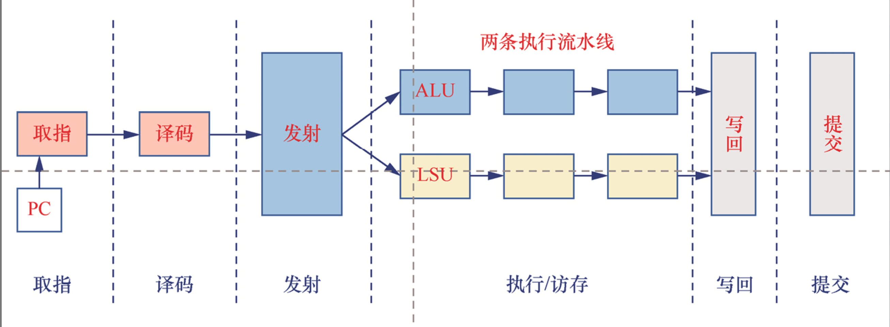
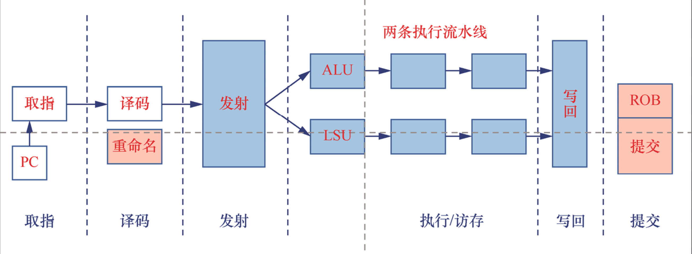

# RISC-V高性能处理器架构分析

## 多周期处理器

取指：从存储器中取出指令。
译码：解析指令编码格式，取出指令类型、源操作数、目标寄存器等信息。
执行：进入执行阶段，完成计算任务，根据不同指令类型完成相应的运算，例如加法指令，对相应操作数执行相加操作。
访存：根据加载或存储指令完成对存储器的访存。
写回：把执行结果写入寄存器堆的目标寄存器中。

当处理器以流水线方式工作时，指令会重叠执行，若前后指令存在依赖关系会使流水线无法正确执行从而引发流水线停顿或者阻塞，这就是流水线冒险问题(hazard)。

常见的流水线冒险问题有如下3种。

+ 数据冒险。产生数据冒险的主要原因是前后指令存在数据依赖关系，即后面的指令要用到前面指令的执行结果，但是前面指令的执行结果还未完成。
+ 控制冒险。指令在流水线里是按程序次序执行的，但遇到分支指令或者跳转指令时会改变指令执行次序，从而导致后续指令被阻塞。  
+ 结构冒险。结构冒险是硬件资源冲突导致的，例如，在指令和数据共用一个存储器的设计中，取指和访存阶段都需要访问内存，但是系统只有一个地址译码器，在一个时钟周期里只能读取一个数据，此时就造成了结构冒险。当然，现代处理器的指令高速缓存和数据高速缓存分离设计已经很好地解决了该问题。解决流水线冒险问题的常用方法有插入空操作、插入气泡、数据转发等。

## 超标量处理器

采用超标量(superscalar)技术。超标量技术也称为多发射流水线，即在处理器内部集成多条流水线，每条流水线里集成了算术逻辑单元ALU、浮点运算单元FPU等，将各种指令分派到这些执行流水线上来同时执行多条指令，以并行处理的方式提高处理器性能。内部只有一条流水线的处理器，称为标量处理器；内部有多条流水线的处理器，称为超标量处理器。以餐馆做菜为例子，我们可以开设两条流水线，即两组人同时进行洗菜、切菜、炒菜、上菜，那么平均1分钟可以完成两道菜，这就是超标量技术在现实生活中的例子。超标量处理器实现的关键是实现多条流水线，每条流水线都集成了执行部件，因此CPI大于1。通常我们使用CPI来衡量一个CPU的性能。2路多发射超标量处理器的理想CPI为2。

| 处理器类型     | 取指      | 译码      | 发射      | 执行      | 写回      | 提交      |
|----------------|-----------|-----------|-----------|-----------|-----------|-----------|
| 顺序执行处理器 | 顺序执行  | 顺序执行  | 顺序执行  | 顺序执行  | 顺序执行  | 顺序执行  |
| 乱序执行处理器 | 顺序执行  | 顺序执行  | 乱序执行  | 乱序执行  | 乱序执行  | 乱序执行  |

##  如何让程序跑的更快

+ 减少总的指令数。优化思路有优化算法、优化程序结构、对编译器做优化等。
+ 减少指令执行的时钟周期数。在多周期处理器设计中，每条指令执行的平均时钟周期数为1，要减少每条指令执行的时钟周期数，只能采用超标量处理器设计，即每个时钟周期可以完成多条指令。
+ 减小时钟周期的长度。要减小时钟周期的长度，需要提升处理器的执行频率，即采用更长、更深的流水线，但是这样会增加处理器电路设计的难度。