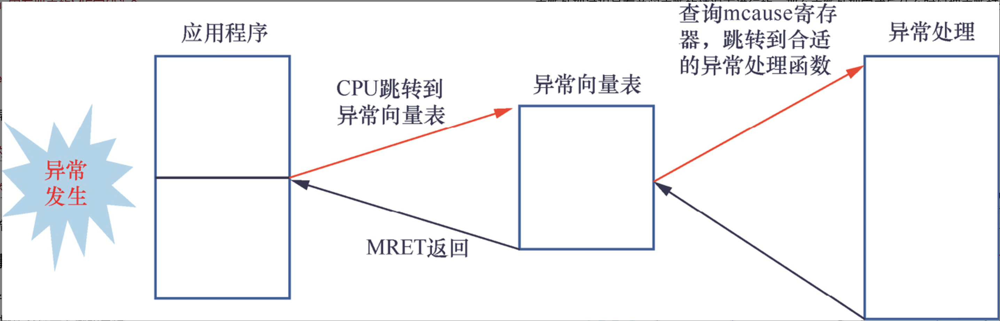
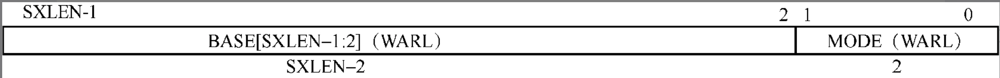
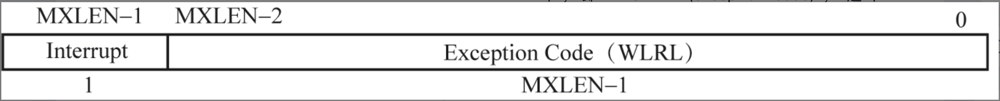
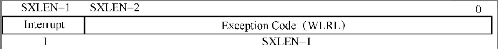
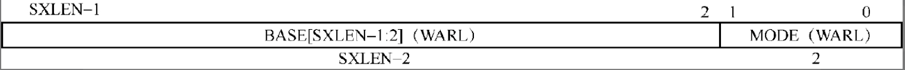

# 异常处理

本章思考题
1. 在RISC-V处理器中，异常有哪几种？
2. 同步异常和异步异常有什么区别？
3. 在RISC-V处理器中，异常发生时CPU自动做了哪些事情？操作系统需要做哪些事情？
4. 返回时，异常是返回到发生异常的指令还是下一条指令？
5. 返回时，异常如何选择处理器的执行状态？
6. 请简述RISC-V体系结构的异常向量表。
7. 异常发生后，软件需要保存异常上下文，异常上下文包括哪些内容？
8. 异常发生后，软件如何知道异常类型？

## 异常处理基本概念

### 异常类型

异常的类型主要有3种：中断、异常和系统调用。

**中断**

通常系统级芯片内部有一个中断控制器，众多外部设备的中断引脚直接连接到中断控制器，由中断控制器负责中断优先级调度，然后发送中断信号给RISC-V处理器。外设中发生重要的事情之后，需要通知处理器。中断发生的时刻和当前正在执行的指令无关，因此中断的发生时间点是异步的，处理器不得不停止当前正在执行的程序来处理中断。中断属于异步模式的异常。

**异常**

异常主要分为**指令访问异常**(instruction access fault)和**数据访问异常**(data access fault)两种。数据访问异常包括**加载访问异常**(load access fault)和**存储访问异常**(store access fault)。

当处理器打开MMU后，若在访问内存地址时发生错误（如缺页等）​，处理器内部的MMU会捕获这些错误并且报告给处理器，从而触发**缺页异常**(page fault)。RISC-V体系结构中常见的缺页异常分为**加载缺页异常**(load pagefault)和**存储缺页异常**(store page fault)。当处理器尝试执行某条指令时发生错误，会触发指令缺页异常。

**系统调用**

RISC-V体系结构提供软件触发的异常，用于系统调用。系统调用允许软件主动通过特殊指令请求更高特权模式的程序所提供的服务。

### 同步异常和异步异常

异常分为同步异常和异步异常两种。同步异常是指处理器执行某条指令直接导致的异常，往往需要在异常处理程序里处理完该异常之后，处理器才能继续执行。
而异步异常是指触发的原因与处理器当前正在执行的指令无关的异常，中断属于异步异常的一种。因此，指令和数据异常称为同步异常，而中断称为异步异常。

### 异常触发与返回的流程

1.　异常发生时CPU做的事情

异常发生时CPU做的事情如下。默认情况下，所有的异常（包括中断）都在M模式下处理。CPU内核能检测到异常的发生，并把异常向量表的入口地址设置到PC寄存器中。CPU会**自动**做如下一些事情。

+ **保存当前PC值到mepc寄存器中。**
+ **把异常的类型更新到mcause寄存器。**
+ **把发生异常时的虚拟地址更新到mtval寄存器中。**
+ **保存异常发生前的中断状态，即把异常发生前的MIE字段保存到mstatus寄存器的MPIE字段中。**
+ **保存异常发生前的处理器模式（如U模式、S模式等）​，即把异常发生前的处理器模式保存到mstatus寄存器的MPP字段中。**
+ **关闭本地中断，即设置mstatus寄存器中的MIE字段为0。**
+ **设置处理器模式为M模式。**
+ **跳转到异常向量表，即把mtvec寄存器的值设置到PC寄存器中。**

上述是RISC-V处理器检测到异常发生后自动做的事情。异常发生之后，还有两个寄存器与异常相关。
+ mtval寄存器：记录发生异常的虚拟地址。
+ mepc寄存器：记录发生异常的指令地址。

另外，在S模式下处理异常的流程也是类似的，前提是异常委派给S模式处理。

2. 操作系统需要做的事情

操作系统需要做的事情是从异常向量表开始的。RISC-V支持两种异常向量表处理模式，一种是直接跳转模式，另一种是异常向量模式。下面是操作系统需要做的事情。

+ **保存异常发生时的上下文，包括所有通用寄存器的值和部分M模式下的寄存器的值。上下文需要保存到栈里。**
+ **查询mcause寄存器中的异常以及中断编号，跳转到对应的异常处理程序中。**
+ **异常或者中断处理完成之后，恢复保存在栈里的上下文。**
+ **执行MRET指令，返回异常现场。**

3.　异常返回

操作系统的异常处理完成后，执行MRET指令即可从异常返回，该指令会自动完成如下工作。

+ **恢复设置MIE字段。把mstatus寄存器中的MPIE字段设置到mstatus寄存器的MIE字段，恢复触发异常前的中断使能状态，通常这相当于使能了本地中断。**
+ **将处理器模式设置成之前保存在MPP字段的处理器模式。**
+ **把mepc寄存器保存的值设置到PC寄存器中，即返回异常触发的现场。**

中断处理过程是在关闭中断的情况下进行的，那么中断处理完成后什么时候把中断打开呢？
+ 当中断发生时，CPU会把mstatus寄存器中的MIE字段保存到MPIE字段中，并且把MIE字段清零，相当于把本地CPU的中断关闭了。
+ 中断处理完成后，操作系统调用MRET指令返回中断现场，于是就将mstatus寄存器中的MPIE字段设置到MIE字段中，相当于把中断打开了。

中断嵌套：在中断处理程序里，手动把门打开（MIE=1），允许新中断进来打断

### 异常返回地址

在RISC-V中，`ra`寄存器用来存放子函数的返回地址，一般用于函数调用，即可以使用RET指令返回到父函数里。但在异常处理中，发生异常时的PC值（指令地址）会自动保存到`mepc`/`sepc`寄存器里。执行`mret`/`sret`指令返回异常现场时，处理器会把`mepc`/`sepc`寄存器的值恢复到PC寄存器中。

这个返回地址是指向发生异常时的指令还是下一条指令呢？需要区分不同的情况。

+ 对于异步异常（中断）​，它的返回地址是第一条还没执行或由于中断没有成功执行的指令。
+ 对于不是系统调用的同步异常，如数据异常、访问没有映射的地址等，它返回的是触发同步异常的那条指令。例如，通过LD指令访问一个地址，这个地址没有建立地址映射，CPU访问这个地址时触发了加载访问异常，陷入内核模式。在内核模式，操作系统把这个地址映射建立起来，然后返回异常现场。此时，CPU会继续执行这条LD指令。刚才因为地址没有映射而触发异常，异常处理中修复了这个映射关系，所以LD可以访问这个地址了。
+ 系统调用返回的是系统调用指令（如ECALL指令）的下一条指令。在操作系统的异常处理程序中需要正确处理mepc/sepc寄存器的值，通常要额外加4字节，这样才能返回系统调用指令的下一条指令。

### 异常返回的处理器模式

异常处理结束之后，当调用MRET指令返回时，要不要切换处理器模式呢？这里需要看mstatus寄存器中MPP字段的值。
+ 如果MPP字段的值为0，表示触发异常时CPU正运行在U模式，那么异常处理结束后会返回U模式。
+ 如果MPP字段的值为1，表示触发异常时CPU正运行在S模式，那么异常处理结束后会返回S模式。
+ 如果MPP字段的值为3，表示触发异常时CPU正运行在M模式，那么异常处理结束后会继续返回M模式。

### 栈的选择

RISC-V体系结构中，所有的处理器模式只有一个sp寄存器。在RISC-V体系结构中，当处理器从一个模式跳转到另外一个模式时，sp寄存器还指向上一个处理器模式的栈地址。此时，需要把上一个处理器模式的sp指针保存起来，可以保存到栈里或者某个特殊的寄存器，然后从这个特殊的寄存器中把当前处理器模式对应的栈地址加载到sp寄存器中。例如，RISC-V体系结构提供一个mscratch/sscratch寄存器，用来保存M模式/S模式的一些核心数据，如sp等。

## 与M模式相关的异常寄存器

与M模式相关的异常寄存器有mstatus、mtvec、mcause、mie、mtval、mip以及mideleg和medeleg等

### mstatus寄存器

mstatus寄存器记录了处理器内核的当前运行状态，包括是否使能了中断等信息。

| 字段 | 位 | 说明 |
| --- | --- | -- |
| `SIE` | Bit\[1\] | 使能S模式下的中断 |
| `MIE` | Bit\[3\] | 使能M模式下的中断 |
| `SPIE` | Bit\[5\] | 临时保存的中断时能状态(S模式下) |
| `MPIE` | Bit\[7\] | 临时保存的中断时能状态(M模式下) |
| `SPP`| Bit\[8\] | 中断之前的特权模式(发生在S模式下的中断) |
| `MPP` | Bit\[12:11\] | 中断之前的特权模式(发生在M模式下的中断) |

mstatus寄存器中的MIE/SIE字段是中断的总开关。而mie寄存器则是每一类具体中断的开关。在使能中断时，建议先使能mie/sie寄存器，后重置mstatus寄存器中的MIE/SIE字段。

### mtvec寄存器

当异常发生时，处理器必须跳转到与异常处理相关的指令并执行。与异常处理相关的指令通常存储在内存中，这个存储位置称为异常向量。在RISC-V体系结构中，异常向量存储在一个表中，称为异常向量表。

RISC-V体系结构的异常向量表支持两种模式。
+ **直接访问模式。**
+ **向量访问模式。**

在M模式下，有一个异常向量表基地址寄存器——`mtvec`(machine trap vector base address)寄存器。它不仅用来设置异常向量表的基地址，还用来设置向量表支持模式。

其中，`BASE`字段用来设置异常向量表的基地址，`MODE`字段用来设置向量访问模式。

+ **0：表示直接访问模式。**
+ **1：表示向量访问模式。**

**直接访问模式**

当设置为直接访问模式时，所有陷入M模式的异常或者中断会自动跳转到BASE字段设置的基地址中。在中断处理函数中读取mcause寄存器来查询异常或者中断触发的原因，然后跳转到对应的异常（中断）处理函数中。在直接访问模式下，异常向量基地址必须按4字节对齐。

**向量访问模式**

当设置为向量访问模式时，中断触发后会跳转到BASE字段指向的异常向量表中，每个向量占4字节，即“BASE + 4(exception code)”​，这个“exception code”是通过查询mcause寄存器得到的。例如，在M模式下，时钟中断触发后会跳转到BASE+0x1C地址处。**在向量访问模式下，异常向量基地址必须按256字节对齐。**

### mcause寄存器

RISC-V体系结构还提供了一个查询异常原因的寄存器——`mcause`(machine cause)寄存器。

其中，最高位为Interrupt字段，其余字段为异常编码(Exception Code, EC)字段。当Interrupt字段为1时，表示触发的异常类型为中断类型；否则，为同步异常类型。

mcause寄存器支持的异常和中断类型

| Interrupt字段 | EC字位 | 说明 |
| --- | --- | -- |
| 1 | 0 | 保留 |
| 1 | 1 | S模式下的软件中断 |
| 1 | 2 | 保留 |
| 1 | 3 | M模式下的软件中断 |
| 1 | 5 | S模式下的时钟中断 |
| 1 | 6 | 保留 |
| 1 | 7 | M模式下的时钟中断 |
| 1 | 8 | 保留 |
| 1 | 9 | S模式下的外部中断 |
| 1 | 10 | 保留 |
| 1 | 11 | M模式下的外部中断 |
| 1 | 12或13 | 保留 |
| 1 | 大于等于16的整数| 预留给芯片设计使用 |
| 0 | 0 | 指令地址没对齐 |
| 0 | 1 | 指令访问异常 |
| 0 | 2 | 非法指令|
| 0 | 3 | 断点 |
| 0 | 4 | 加载地址没对齐 |
| 0 | 5 | 加载访问异常 |
| 0 | 6 | 存储/AMO地址没对齐 |
| 0 | 7 | 存储/AMO访问异常 |
| 0 | 8 | 来自U模式的系统调用 |
| 0 | 9 | 来自S模式的系统调用 |
| 0 | 11 | 保留 |
| 0 | 12 | 指令缺页异常 |
| 0 | 13 | 加载缺页异常 |
| 0 | 14 | 保留 |
| 0 | 15 | 存储/AMO缺页异常 |
| 0 | 16~23的整数 | 保留 |
| 0 | 24~31的整数 | 预留给芯片设计使用|
| 0 | 32~47的整数 | 保留 |
| 0 | 48~63的整数 | 预留给芯片设计使用 |
| 0 | 大于或等于64的整数 | 保留 |

### mie寄存器

mie(machine interrupt enable)寄存器用来单独使能和关闭M模式下的中断。

| 字段 | 位 | 说明 |
| --- | --- | -- |
| `SSIE` | Bit\[1\] | 使能S模式下的软件中断 |
| `MSIE` | Bit\[3\] | 使能M模式下的软件中断 |
| `STIE` | Bit\[5\] | 使能S模式下的时钟中断 |
| `MTIE` | Bit\[7\] | 使能M模式下的时钟中断 |
| `SEIE` | Bit\[9\] | 使能S模式下的外部中断 |
| `MEIE` | Bit\[11\] | 使能M模式下的外部中断 |

### mtval寄存器

当处理器陷入M模式时，mtval寄存器记录发生异常的虚拟地址。

### mip寄存器

mip(machine interrupt pending)寄存器用来指示哪些中断处于等待响应状态。

| 字段 | 位 | 说明 |
| --- | --- | -- |
| SSIP | Bit\[1\] | S模式下的软件中断处于等待响应状态 |
| MSIP | Bit\[3\] | M模式下的软件中断处于等待响应状态 |
| STIP | Bit\[5\] | S模式下的时钟中断处于等待响应状态 |
| MTIP | Bit\[7\] | M模式下的时钟中断处于等待响应状态 |
| SEIP | Bit\[9\] | S模式下的外部中断处于等待响应状态 |

### mideleg和medeleg寄存器

在默认情况下，所有的异常和中断都在M模式下处理。但是，RISC-V体系结构提供了一种委托机制，即把部分异常和中断全盘委托给S模式来处理，这可以消除模式间切换带来的额外性能损失，从而提高性能。

RISC-V体系结构实现了两个委托寄存器，用来把部分异常以及中断委托给S模式处理。运行在M模式下的软件（如OpenSBI）可以通过设置mideleg和medeleg寄存器相应的位，有选择地将中断和异常委托给S模式。

在RISC-V体系结构中，高特权模式触发的异常或者中断是不能委派给低特权模式来处理。仅当发生在S/U模式时，设置medeleg和mideleg寄存器可以把这些异常或者中断委派到S模式来处理，因为默认情况下是由M模式优先处理。仅S/U模式触发的中断位（如SSIP、STIP、SEIP）有效。

mideleg寄存器用来设置中断委托。

| 字段 | 位 | 说明 |
| --- | --- | -- |
| SSIP | Bit\[1\] | 把软件中断委托给S模式 |
| STIP | Bit\[5\] | 把时钟中断委托给S模式 |
| SEIP | Bit\[9\] | 把外部中断委托给S模式 |

medeleg寄存器用来设置异常委托。

| 位 | 说明 |
| --- | -- |
| Bit\[0\] | 把未对齐的指令访问异常委托给S模式 |
| Bit\[1\] | 把指令访问异常委托给S模式 |
| Bit\[2\] | 把无效指令异常委托S模式 |
| Bit\[3\] | 把断点异常委托给S模式 |
| Bit\[4\] | 把未对齐加载访问异常委托给S模式 |
| Bit\[5\] | 把加载访问异常委托给S模式 |
| Bit\[6\] | 把未对齐存储/AMO访问异常委托给S模式 |
| Bit\[7\] | 把存储/AMO访问异常委托给S模式 |
| Bit\[8\] | 把来自用户模式的系统调用委托给S模式 |
| Bit\[9\] | 把来自管理员特权模式的系统调用处理委托给S模式 |
| Bit\[12\] | 把指令缺页异常委托给S模式 |
| Bit\[13\] | 把加载缺页异常委托给S模式 |
| Bit\[15\] | 把存储/AMO缺页异常委托给S模式 |

### 配置中断

在M模式下，配置中断的基本步骤如下。

1. 配置mtvec寄存器来设置异常向量的入口地址以及访问模式。
2. 配置和初始化中断，例如，配置PLIC来初始化外设中断。
3. 配置mie寄存器来使能中断，例如，使能M模式以及S模式下的中断，包括软件中断、时钟中断以及外部中断等。
4. 配置mstatus寄存器来打开处理器的中断总开关。

## 与S模式相关的异常寄存器

与S模式相关的异常寄存器有sstatus、sie、sip、scause以及stvec等。式相关的异常寄存器

### sstatus寄存器

S模式下有一个记录处理器内核运行状态的寄存器，即sstatus寄存器。对sstatus寄存器所做的更改会反映在mstatus寄存器中，对mstatus寄存器所做的更改也会反映在sstatus寄存器中。

| 字段 | 位 | 说明 |
| --- | --- | -- |
| SIE | Bit\[1\] | 使能S模式下的中断 |
| SPIE | Bit\[5\] | 之前的中断使能状态(S模式下) |
| SPP | Bit\[8\] | 中断之前的特权模式(发生在S模式下的中断) |

### sie寄存器

sie(supervisor interrupt enable)寄存器用来单独使能和关闭S模式下的中断。

| 字段 | 位 | 说明 |
| --- | --- | -- |
| SSIE | Bit\[1\] | 使能S模式下的软件中断 |
| STIE | Bit\[5\] | 使能S模式下的时钟中断 |
| SEIE | Bit\[8\] | 使能S模式下的外部中断 |

### sip寄存器

sip(supervisor interrupt pending)寄存器用来指示哪些寄存器处于等待响应状态。

| 字段 | 位 | 说明 |
| --- | --- | -- |
| SSIP | Bit\[1\]| S模式下的软件中断处于等待响应状态 |
| STIP | Bit\[5\]| S模式下的时钟中断处于等待响应状态 |
| SEIP | Bit\[9\]| S模式下的外部中断处于等待响应状态 |

### scause寄存器

RISC-V体系结构提供了一个查询S模式下异常原因的寄存器——scause(supervisor cause)寄存器。

其中，最高位为Interrupt字段，其余位为EC字段。当Interrupt字段为1时，表示触发的异常类型为中断类型；否则，为同步类型异常。

| Interrupt字段 | EC字段 | 说明 |
| --- | --- | -- |
| 1 | 0 | 保留 |
| 1 | 1 | S模式下的软件中断 |
| 1 | 2~4的整数 | 保留 |
| 1 | 5 | S模式下的时钟中断 |
| 1 | 6~8的整数 | 保留 |
| 1 | 9 | S模式下的外部中断 |
| 1 | 大于或等于10的整数 | 保留 |
| 0 | 0 | 指令地址没对齐 |
| 0 | 1 | 指令访问异常 |
| 0 | 2 | 无效指令 |
| 0 | 3 | 断点 |
| 0 | 4 | 保留 |
| 0 | 5 | 加载访问异常 |
| 0 | 6 | 存储/AMO地址没对齐 |
| 0 | 7 | 存储/AMO访问异常 |
| 0 | 8 | 来自用户模式的系统调用 |
| 0 | 9~11的整数 | 保留 |
| 0 | 12 | 指令缺页异常 |
| 0 | 13 | 加载缺页异常 |
| 0 | 14 | 保留 |
| 0 | 15 | 存储/AMO缺页异常 |
| 0 | 大于或等于16的整数 | 保留 |

> AMO = Atomic Memory Operation（原子内存操作）

### stvec寄存器

S模式下需要配置异常向量基地址和向量访问模式的。在S模式下支持两种异常向量的访问模式——直接访问模式和向量访问模式。

在S模式下，有一个用来设置异常向量基地址的管理者异常向量表基地址寄存器——stvec(supervisor trap vector baseaddress)寄存器。stvec寄存器有两个作用：一是用来设置异常向量的基地址，二是用来设置异常向量访问模式。

其中，BASE字段用来设置异常向量表的基地址，MODE字段用来设置异常向量访问模式。
+ 0：直接访问模式。
+ 1：向量访问模式。

**直接访问模式**

在直接访问模式下，所有陷入S模式的异常或者中断都会跳转到BASE字段设置的基地址中。在异常处理函数中读取scause寄存器来查询触发异常或者中断的原因，然后跳转到对应的异常（中断）处理函数中。
 
在直接访问模式下，异常向量基地址必须按4字节对齐。

**向量访问模式**

在向量访问模式下，异常触发后会跳转到BASE字段指向的异常向量表中，每个向量占4字节，即“BASE + 4(exception code)”​，这个“exception code”是通过查询`scause`寄存器得到的。

在向量访问模式下，异常向量基地址必须按256字节对齐。

### stval寄存器

当处理器陷入S模式时，stval寄存器记录发生异常的虚拟地址。

##  异常上下文

异常发生时需要保存发生异常的现场，以免破坏异常发生前正在处理的数据和程序状态。需要在栈空间里保存如下内容。

+ x1~x31通用寄存器的值。
+ sepc寄存器的值。
+ sstatus寄存器的值。
+ sbadaddr寄存器的值。
+ scause寄存器的值。

这个栈空间指的是发生异常时进程的内核模式的栈空间。在操作系统中，每个进程都有一个内核模式的栈空间。异常包括同步异常和异步异常（中断）​。

| 旧名称 | 新名称 | 说明 |
| ------ | ------ | ----- |
| sbadaddr | stval | S态异常值寄存器 |
| mbadaddr | mtval | M态异常值寄存器 |