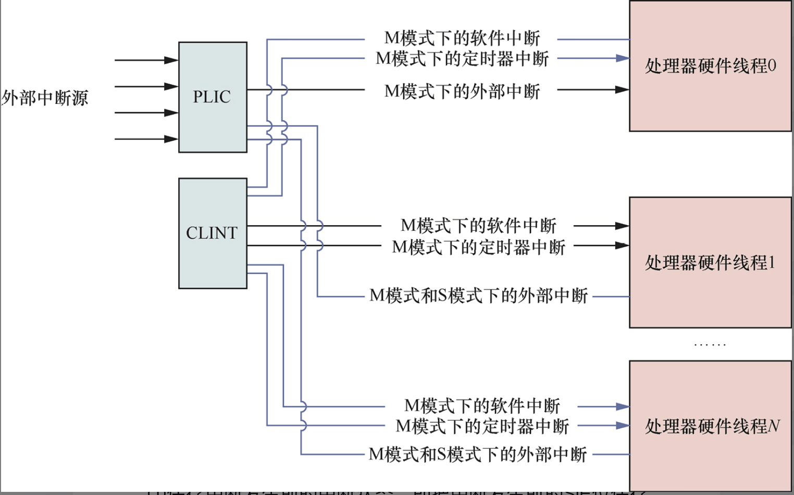
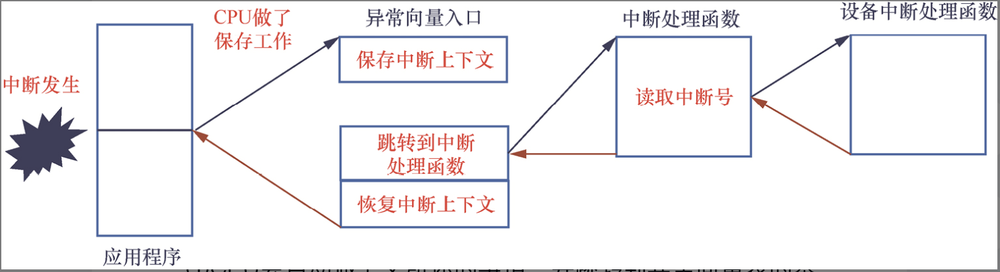

# 中断处理与中断控制器

本章思考题
1. 请简述中断处理的一般过程。
2. 什么是中断现场？对于RISC-V处理器来说，中断现场应该保存哪些内容？
3. 中断现场保存到什么地方？

## 中断处理基本概念

在RISC-V架构里，中断属于异步异常的一种，其处理过程与异常处理很类似。许多RISC-V处理器同时支持M模式和S模式下的中断。在默认情况下，中断会在M模式下处理。如果处理器支持S模式，那么可以有选择地把部分中断委托给S模式处理。

### 中断类型

RISC-V架构把中断分成4类。

+ **软件中断(software interrupt)**。
+ **定时器中断(timer interrupt)**。
+ **外部中断(external interrupt)**。
+ **调试中断(debug interrupt)**。

软件中断指的是由软件触发的中断，通常用于处理器内核之间的通信，即处理器间中断(Inter-Processor Interrupt,IPI)。

定时器中断指的是来自定时器的中断，通常用于操作系统的时钟中断。在RISC-V体系结构中，M模式和S模式下都有定时器。RISC-V体系结构规定处理器必须有一个定时器，通常实现在M模式下。RISC-V体系结构还为定时器定义了两个64位的寄存器mtime和mtimecmp，它们通常实现在处理器内核本地中断器(Core-Local Interruptor, CLINT)中。

外部中断通常是指来自处理器外部设备（如串口设备等）的中断。RISC-V体系结构在M模式和S模式下都可以处理外部中断。为了支持更多的外部中断源，处理器一般采用中断控制器进行管理。例如，RISC-V体系结构定义了一个平台级别的中断控制器(Platform-Level Interrupt Controller, PLIC)，用于外部中断的仲裁和派发。

调试中断一般用于硬件调试。

在RISC-V处理器中，中断按照功能又可以分成如下两类。

+ 本地(local)中断：直接发送给本地处理器的硬件线程(Hart)，它是一个处理器私有的中断并且有固定的优先级。本地中断可以有效缩短中断延时，因为它不需要经过中断控制器的仲裁以及额外的中断查询。软件中断和时钟中断是常见的本地中断。本地中断一般由CLINT产生。

+ 全局(global)中断：通常指的是外部中断，经过PLIC的路由，送到合适的处理器内核。PLIC支持更多的中断号、可配置的优先级以及路由策略等。



### 中断处理过程

（硬件自动做的）

触发中断后，默认情况下由M模式响应和处理。处理器所做的事情与异常处理类似。这里假设中断已经委派给S模式并由S模式来处理。处理器做如下事情。

1. 保存中断发生前的中断状态，即把中断发生前的SIE位保存到sstatus寄存器的SPIE字段。
2. 保存中断发生前的处理器模式状态，即把异常发生前的处理器模式编码保存到sstatus寄存器的SPP字段。
3. 关闭本地中断，即设置sstatus寄存器中的SIE字段为0。
4. 把中断类型更新到scause寄存器中。
5. 把触发中断时的虚拟地址更新到stval寄存器中。
6. 把当前PC值保存到sepc寄存器中。
7. 跳转到异常向量表，即把stvec寄存器的值设置到PC寄存器中。

操作系统软件需要读取以及解析scause寄存器的值来确定中断类型，然后跳转到相应的中断处理函数。

中断处理完成之后，需要执行SRET指令退出中断。SRET指令会执行如下操作。

1. 恢复SIE字段，该字段的值从`sstatus`寄存器中的SPIE字段获取，这相当于使能了本地中断。
2. 将处理器模式设置成之前保存到SPP字段的模式编码。
3. 设置PC为`sepc`寄存器的值，即返回异常触发的现场。



### 中断委派和注入

把中断委托给 S 模式后，CPU 自动跳转到 S 模式下的异常向量表入口地址

### 中断优先级

RISC-V体系结构支持的多种不同类型的中断是有优先级的。如果多个不同类型的中断同时触发，RISC-V处理器会优先处理优先级高的中断。中断类型按优先级从高到低的排序如下。

+ M模式下的外部中断。
+ M模式下的软件中断。
+ M模式下的定时器中断。
+ S模式下的外部中断。
+ S模式下的软件中断。
+ S模式下的定时器中断。

## CLINT

RISC-V处理器一般支持软件中断、定时器中断这两种本地中断，它们属于处理器内核私有的中断，直接发送到处理器内核，而不需要经过中断控制器的路由。


CLINT支持的中断采用固定优先级策略，高优先级的中断可以抢占低优先级的中断。

| 名称 | 中断号 | 说明 |
| --- | --- | -- |
| SSIP | 1 | S模式下的软件中断 |
| MSIP | 3 | M模式下的软件中断 |
| STIP | 5 | S模式下的时钟中断 |
| MTIP | 7 | M模式下的时钟中断 |
| SEIP | 9 | S模式下的外部中断 |
| MEIP | 11 | M模式下的外部中断 |

## PLIC

PLIC主要用来管理外部中断，最多支持1024个中断源与15872个中断硬件上下文(context)。

> 中断硬件上下文 = 一个可以独立接收和处理中断的特权模式实例
> 中断上下文数 = 硬件线程数 × 可处理中断的特权模式数


PLIC的区域映射[参考文档](../riscv-plic-1.0.0.pdf)
```
+---------------------------------------------------------------+
| 0x0000_0000 ~ 0x0000_0FFF  —— 中断优先级 Priority            |
+---------------------------------------------------------------+
| 0x0000_1000 ~ 0x0000_107F  —— 中断挂起 Pending               |
+---------------------------------------------------------------+
| 0x0000_2000 ~ 0x0007_FFFF  —— 中断使能 Enable                |
+---------------------------------------------------------------+
| 0x0002_0000 ~ 0x3FFF_FFFF  —— Context（阈值 & claim/complete）|
+---------------------------------------------------------------+
```

```
1个物理核心 = 2个Hart

┌──────────────────┐
│    物理核心       │
│                  │
│  ┌────────────┐  │
│  │  Hart 0    │  │  ← 硬件线程0
│  └────────────┘  │
│                  │
│  ┌────────────┐  │
│  │  Hart 1    │  │  ← 硬件线程1
│  └────────────┘  │
└──────────────────┘

共享：
- L1 Cache
- 执行单元（部分）
- TLB

独立：
- PC
- 通用寄存器（x0-x31）
- CSR寄存器
```

### 中断号

### 中断优先级

对每个中断源都可以设置中断优先级，PLIC支持7级中断优先级。其中，0表示不会触发中断或者关闭中断，1表示最低中断优先级，7表示最高中断优先级。如果两个相同优先级的中断同时触发，那么编号小的中断具有较高优先级。

PLIC为每个中断号提供一个寄存器来设置相应中断的优先级，

| 字段 | 位 | 属性 | 说明 |
| ---- | --- | ---- | --- |
| Priority | Bit\[2:0\] | RW | 设置中断优先级 |
| Reserved | Bit\[31:3\] | RO | 保留 |

### 中断使能寄存器

PLIC提供中断使能寄存器，它可以为每个处理器内核使能和关闭中断源。中断使能寄存器中的每一位表示一个中断源。一个寄存器可以表示32个中断源。因为PLIC最多支持1024个中断源，所以一共需要128字节来管理中断源。

### 中断待定寄存器

中断待定寄存器中的每一位表示一个中断源。一个寄存器可以表示32个中断源。因为PLIC最多支持1024个中断源，所以一共需要128字节来管理中断源。

### 中断优先级阈值寄存器

PLIC提供了一个处理器上下文级别的中断优先级阈值寄存器，它用来屏蔽所有优先级小于或等于阈值的中断源，只有当中断优先级大于该中断源的优先级阈值时，PLIC才会处理该中断。

### 中断请求/完成寄存器

中断请求(claim)寄存器和中断完成(complete)寄存器是同一个寄存器。

当触发中断时，软件通过读取中断请求寄存器可知哪个中断源是当前待定中断源中优先级最高的，软件可以在中断处理程序中处理该中断。

中断处理程序执行完后，软件可以把中断号写入中断完成寄存器中，PLIC便知道软件已经完成了中断处理，PLIC完成最后的中断处理工作。
